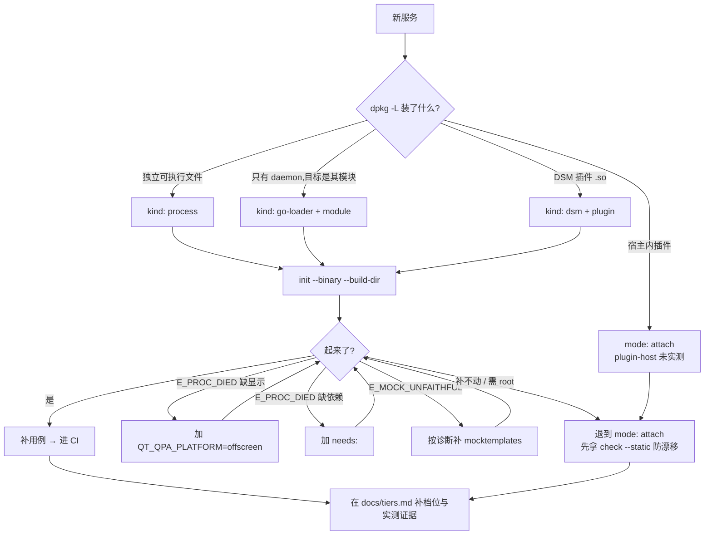

# 配置编写规则(authoring guide)

[service-yaml.md](service-yaml.md) 讲**字段是什么**,[primitives.md](primitives.md) 讲**原语怎么写**。
本文讲**怎么决策**:面对一个新服务,每个字段该填什么、依据是什么、卡住了怎么办。

---

## 第零条规则:不要手写,先 `init` 再删改

```bash
cd <repo>
cmake --build build                    # 或 go build -o out/ ./...
dbus-testing init --binary build/<可执行文件> --build-dir build
```

`init` 把**能探测到的事实**自动填好:

| 它填好的 | 依据 |
|---|---|
| `services:` / `ready.name-owner` | 在私有总线上拉起后,实际观察到它注册了哪些名字 |
| `sandbox.env` 里的 `QT_QPA_PLATFORM=offscreen` | 首次拉起失败且输出命中显示相关关键字时自动重试并写回 |
| `contract.xml` | 运行时 introspect + 规范化 |
| `tests.yaml` 里属性类用例 | 每个属性一条类型断言;只读属性再加一条 `PropertyReadOnly` 错误路径 |
| `binary.search` 的 `${BUILD_DIR}` 相对化 | 便于跨机复用 |

你只需要填它**探测不到的事实**——下面逐项说规则。

> `init` **不会**主动调用被测方法(无法预知副作用:可能挂起,可能改系统状态),
> 所以方法用例是注释态并带出入参签名提示,补上真实参数后取消注释。

---

## 一、`service.yaml`

### 1.1 `kind` —— 看 deb 装了什么就能定

```bash
dpkg -L <包名> | grep -E "(bin|libexec)/|\.so"
```

| 看到什么 | `kind` | 还要补 |
|---|---|---|
| 独立可执行文件(`/usr/bin/xxx`、`/usr/lib/deepin-api/xxx`) | `process` | 只需 `binary.search` |
| 只有 daemon 二进制,目标服务是它的一个模块 | `go-loader` | `module: <模块名>` |
| `deepin-service-manager/lib*.so` + `plugin-*.json` | `dsm` | `plugin: <so 路径>` |
| dde-shell applet / tray-loader 插件 | `plugin-host` | **未实测,先用 `mode: attach`** |

真实例子:

```
dde-api            → /usr/lib/deepin-api/hans2pinyin                              → process
dde-daemon         → 只有 /usr/libexec/deepin/dde-session-daemon,模块无独立二进制  → go-loader
dde-appearance     → deepin-service-manager/libplugin-dde-appearance.so           → dsm
dde-application-manager → /usr/bin/dde-application-manager                        → process
```

`go-loader` 的 `module` 名怎么找:看 daemon 源码里 `loader.NewModuleBase("<名字>", ...)`,或直接
`<daemon> --list` 看它认哪些模块。框架组出的命令是 `<daemon> --enable <module> -i`。

让 `init` 直接按 loader 形态生成配置(参数放在 `--` 之后原样透传):

```bash
dbus-testing init --binary /usr/libexec/deepin/dde-session-daemon \
    --out tests/dbus -- --enable timedate
```

`init` 会识别 `--enable <module>`,生成 `kind: go-loader` + `module:` 的规范形态(而不是一串裸 `args:`),并自动剥掉 launcher 会补的 `-i`。

### 1.2 `mode` —— 默认 `isolate`,只有起不来才退 `attach`

| | `isolate`(默认) | `attach` |
|---|---|---|
| 环境 | 私有总线 + 临时 HOME | 当前真实会话 |
| 能力 | 全部原语 | **默认只读**;调方法需 `allow.methods` 显式放行 |
| 什么时候用 | 能拉起来就用它 | mock 补不动、需 root、`plugin-host` 形态 |

**卡住不要停**:退到 `attach` 至少能拿到 `check` 与 `check --static` 的防漂移能力,mock 以后再补。

### 1.3 `binary.search` —— 三条,顺序固定

```yaml
binary:
  search:
    - ${BUILD_DIR}/<构建产物相对路径>       # 1. 最常见位置
    - ${BUILD_DIR}/bin/<文件名>             # 2. 备用布局
    - /usr/bin/<文件名>                     # 3. 兜底(可省)
```

规则:**构建产物在前,系统路径只做兜底**。不传 `--build-dir` 时 `${BUILD_DIR}` 候选自动跳过(不报错),
所以本地开发和 CI 用同一份配置;失败时诊断会逐条列出候选及判定原因。

反模式:只写系统路径 —— 那就变成"测已安装的版本",不是测你刚构建的代码。

### 1.4 `sandbox.env` —— 按症状加,不要预先堆

| 症状 | 加什么 |
|---|---|
| `E_PROC_DIED` 且输出含 `platform plugin` / `xcb` / `could not connect to display` | `QT_QPA_PLATFORM: offscreen` |
| 服务读 DConfig 时报 appid 相关错 | `DSG_APP_ID: <appid>`(从源码里的 `setenv("DSG_APP_ID", ...)` 抄) |

`init` 命中显示相关关键字时会自动重试并写回,通常不用手填。

### 1.5 `needs` —— **不要猜,跑一次让诊断告诉你**

这是最容易做错的地方。正确循环:

```
1. 先不写 needs,直接 run
2. 报 E_PROC_DIED + 提示"依赖缺失即 abort" → 看输出里提到哪个服务名
3. 加 `- mock: <对应模板>` 再 run
4. 报 E_MOCK_UNFAITHFUL → 诊断直接给出缺失方法全名 + AddMethod 片段
5. 在框架仓 mocktemplates/ 补该方法 → 回到第 3 步
```

ApplicationManager1 就是这么补出来的:

```
上游 systemd 模板 → UnknownMethod: ...Manager.Subscribe
  → 补 Subscribe   → no such property Environment
  → 补 Manager.Environment → 通过
```

**不要一次性猜全套接口面**:既慢,又容易过度 mock 把真实依赖问题掩盖掉。

模板从哪来:

| 情况 | 做法 |
|---|---|
| 上游 python-dbusmock 已有 | 直接用名字:`logind` / `upower` / `networkmanager` / `timedated` / `polkitd` / `systemd` |
| 上游不够用 | 写在**框架仓** `dbus_testing/mocktemplates/`(如 `systemd_dde`),PR 回贡 |
| —— | **不要写在被测仓里**:mock 是跨仓共享资产,一个仓补好所有仓受益 |

### 1.6 `ignore.paths` —— 只在有动态子对象时加

判断方法:`scan` 出来的对象数明显偏多,或 introspect 根路径下有大量同构子节点(ObjectManager 模式)。

```yaml
ignore:
  paths: ["/org/desktopspec/ApplicationManager1/*"]
```

效果:基线里这一节归并成一个 `collapsed="true"` 节点,只留一份样本 —— 既保留"这里有动态子对象"
这个事实,又不会把上百个子对象全 introspect 一遍。

`ignore.interfaces` 默认就是 `["org.freedesktop.DBus.*"]`,一般不动。要豁免废弃成员才用 `ignore.methods`。

### 1.7 其余字段

| 字段 | 规则 |
|---|---|
| `ready.name-owner` | 缺省等于 `services`,**通常不用写**;单进程注册多名字时 `services` 必须列全,全部就绪才算 READY |
| `ready.timeout` | 默认 10s。慢服务别改配置,CI 统一用 `--timeout-scale` |
| `allow.methods` | **只有 `attach` 才需要**。默认空 = 只读。放行前先想破坏性:注销/关机/写配置类**绝不放行** |
| `auth.polkit` | 方法级声明。声明了但 `needs` 里没 polkitd mock,框架会告警 |
| `system-bus` | 服务注册在 system bus 上才置 `true` |
| `isolation` | 默认 `per-run`。只有确认用例间互相污染才改 `per-case`(慢很多) |
| `tier` | 实测通过后再填,并同步到 [tiers.md](tiers.md) |

---

## 二、`contract.xml`

**规则:永远不手写,永远人工审。**

```bash
dbus-testing scan tests/dbus/ --emit --build-dir build    # 生成/更新
git diff tests/dbus/contract.xml                          # 审这个 diff
```

| 场景 | 做法 |
|---|---|
| 首次接入 | `init`/`scan` 生成 → 通读确认"这就是我要对外承诺的接口面" → 入仓 |
| 接口有意变更 | 改代码 → `scan --emit` → PR 里让 reviewer 看 `contract.xml` 的 diff |
| CI 报 `E_CONTRACT_DRIFT` 而你没打算改接口 | **这是回归**。不要更新基线,去查代码 |

判断"该不该更新基线"只有一个标准:**这次接口变更是有意的吗**。
是 → 更新并在 review 里说明;不是 → 修代码。

反模式:手写基线(规范化有严格的排序与 direction 归一规则,手写必然产生 diff 噪声);
契约一报警就 `scan --emit`(那是把回归当变更接受了)。

---

## 三、`tests.yaml`

### 3.1 补用例的优先级(按投入产出排)

```
1. check-contract              —— init 已给,零成本,收益最大
2. 属性 get-prop + type        —— init 已给
3. 只读属性的 set-prop 错误路径 —— init 已给
4. 无入参方法的签名断言         —— 取消 init 的注释即可
5. 有入参方法:补真实参数 + value/signature 断言   ← 你的主要工作
6. 边界与错误路径:空输入、非法参数、不存在的方法
7. 动作 → 信号
8. 有外部副作用的行为          —— 走 test_extra.py,不要硬塞 YAML
```

### 3.2 断言选哪个

| 想验证 | 用 | 例子 |
|---|---|---|
| 返回值就该是这个 | `value` | `expect: {value: ["shendu", "shenduo"]}` |
| 返回值不稳定,但类型/结构要稳 | `signature` | `expect: {signature: "a{oa{sa{sv}}}"}` |
| 属性类型 | `type` | `expect: {type: s}` |
| 有值就行(版本号之类) | `nonempty` | `expect: {type: s, nonempty: true}` |
| 该报错 | `error` | 见下 |

**`error` 四种语义**——写错等于没测:

```yaml
call: {method: X}                                            # 不写 = 隐含必须无错
expect: {error: null}                                        # 显式必须无错
expect: {error: "*"}                                         # 必须出错,名字不限
expect: {error: org.freedesktop.DBus.Error.PropertyReadOnly}  # 必须是这个错误名
```

规则:**能写具体错误名就别写 `"*"`**。`"*"` 只用于"不关心具体错误,只要求不崩"的边界用例。

### 3.3 什么不该写进 YAML

| 情况 | 去哪 |
|---|---|
| 需要条件分支、循环、变量传递 | 逃生舱(六原语故意不支持这些) |
| 断言外部副作用(起了进程?写了文件?窗口出现了?) | 逃生舱 |
| 窄类型入参(byte / uint16 等) | 逃生舱。`tests.yaml` 无入参类型标注,YAML 整数按 int32 编码会被服务拒收 |
| 有破坏性的调用(注销、关机、删数据) | 想清楚它会不会碰真实文件系统,通常根本不测 |

`examples/graphic1/tests.yaml` 里有两个真实示范:

- `Rgb2Hsv` 入参是 `byte(yyy)` → 写成 `skip:` 并注明原因,而不是留一条注定失败的用例;
- Graphic1 的多数方法会**写图片文件** → 样板一律不调用,只保留契约比对与纯计算方法的签名断言。

**这就是规则:样板只写接口真实存在、且零副作用的东西。**

### 3.4 用例命名

`<成员>-<验证点>`,小写连字符:`query-returns-pinyin`、`name-readonly`、`identify-rejects-bad-fd`。
`init` 生成的就是这个风格,跟着写。一份 `tests.yaml` 内不能重名(重名报 `E_CONFIG_INVALID`)。

### 3.5 用 `skip:` 而不是注释掉

```yaml
- name: pending-upstream
  skip: 等待 dde-xxx 修复 #1234
  call: {method: Broken}
```

`skip` 的原因会出现在终端与报告里,比注释掉可追踪。

---

## 四、新服务接入决策树



**任何一步卡住都不要停在那里**:退到 `attach` + `check --static`,契约层的价值本身就占大头。

---

## 五、反模式清单

| 别这么做 | 为什么 |
|---|---|
| 手写 `contract.xml` | 规范化格式有严格规则,手写必然 diff 噪声 |
| 预先猜一大堆 `needs` | 过度 mock 会掩盖真实依赖问题;让诊断驱动 |
| 在被测仓里写 mock 模板 | mock 是跨仓共享资产,回贡到框架仓 |
| `binary.search` 只写系统路径 | 变成"测已安装版本",不是测刚构建的代码 |
| `attach` 模式往 `allow.methods` 里塞一堆 | 真实会话,一次误配可能搞掉会话 |
| 用 `expect: {error: "*"}` 糊所有错误路径 | 等于没验证错误契约 |
| 契约一报警就 `scan --emit` | 把回归当变更接受了 |
| 为了让用例过而改宽断言 | 断言是契约;改断言前先确认接口变更是有意的 |
| 凭源码推断档位填 `tier` | 档位只由实测认定(Graphic1 被静态判断为"依赖 X11",实测无显示下正常注册) |

---

## 六、提交前检查单

- [ ] `service.yaml` / `contract.xml` 已入仓,`tests.yaml` 至少有 `check-contract`
- [ ] `contract.xml` 人工审过
- [ ] `binary.search` 第一条指向构建产物
- [ ] GUI 服务加了 `QT_QPA_PLATFORM=offscreen`
- [ ] 有外部依赖的服务写了 `needs:`,且 mock 模板已回贡框架仓
- [ ] 动态子对象服务写了 `ignore.paths`
- [ ] `attach` 模式确认 `allow.methods` 为空或只含安全方法
- [ ] `dbus-testing run tests/dbus/ --build-dir <构建目录>` 本地跑绿
- [ ] CI 里 `check --static` 与 `run` 都挂上了
- [ ] [tiers.md](tiers.md) 补了档位与实测证据
