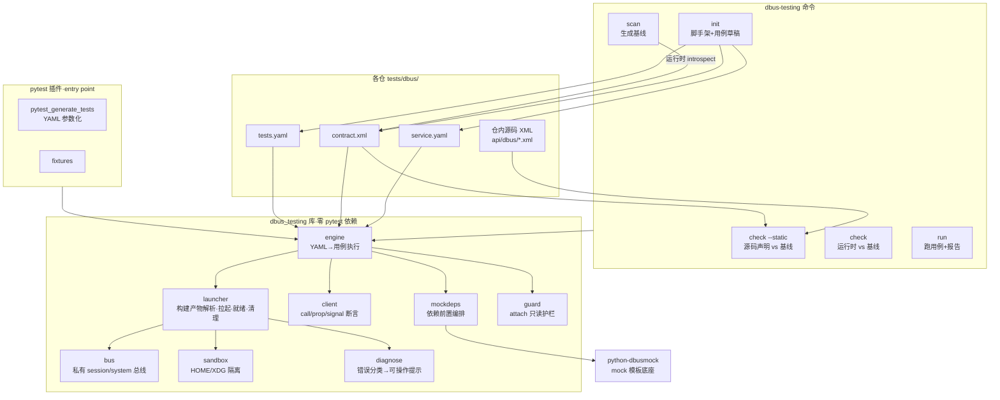

# DDE DBus 接口自动化测试框架设计方案(v4)

> 状态:设计修订稿 · 适用范围:deepin/DDE 全部注册 DBus 接口的项目(21 仓) · 修订日期:2026-09-03
>
> **v4 相对 v3 的修改(补齐"框架产品化"面)**
> 1. 新增 **§4 五分钟接入**与 `dbus-testing init` 脚手架——自动生成配置骨架与**首批用例草稿**,这是"方便"的核心;
> 2. 新增 **§10 易用性与诊断设计**:错误分类 → 可操作提示;`--keep-bus` / `--shell` 调试开关;
> 3. 新增 **§13 框架自身工程化**:仓/包结构、发布、`apiVersion` 兼容策略、mock 模板贡献流程;
> 4. 新增 **§14 框架自测策略**:自带 fixture 服务,不依赖 DDE 环境;
> 5. 新增 **§17 推广与接入路径**:分档看板 + 样板仓 + 文档;
> 6. 分期计划相应补入 init / 诊断 / 自测 / 看板。
>
> **v3 修改**:分档表只保留实测项(T1 = Pinyin1、Graphic1);`attach` 默认只读 + allowlist;`services:` 多服务名;`check --static` 提为一等能力;`auth` 方法级;总线粒度与超时约定;Go 构建命令修正。
> **v2 修改**:删除"系统已安装"前提(改构建产物);澄清两个正交轴;引入服务分档;密闭模式为主线;契约基线改用规范化 introspection XML。

---

## 1. 背景与问题

deepin 桌面各项目(dde-control-center、dde-shell、dde-daemon、dde-application-manager 等 21 仓)通过 DBus 对外暴露接口,目前**没有统一的接口自动化测试方案**:

- 各仓测试形态散装(gtest / QtTest / go test),DBus 接口测试几乎为零或半接入;
- 接口无机器可读基线,签名漂移、误删接口只能靠人肉发现;
- 接口盘点靠人工,21 仓维护成本极高;
- 测试需要隔离总线、mock 外部依赖,每仓各自踩坑。

服务有四种宿主形态:独立进程注册 / deepin-service-manager(DSM)插件 / 插件宿主内嵌 / Go loader 模块。

### 1.1 市面方案调研结论

| 层 | 市面现状 | 决策 |
|---|---|---|
| 行为 mock(伪造外部服务) | **python-dbusmock**:事实标准,活跃维护(2026-08 仍在提交),内置 logind/upower/NetworkManager/BlueZ/timedated/systemd/polkitd 等 20+ 模板,自带 pytest fixtures | **直接采用,不造** |
| 私有总线管理 | 标准件但都很薄:dbus-run-session(fd.o)、GTestDBus(GLib/C)、dbusmock 自带 start_session_bus | 复用 dbusmock,框架只补薄封装 |
| 接口扫描 / 基线生成 | **空白**。qdbusxml2cpp / gdbus-codegen / dbusutil-gen 均为绑定代码生成器,不产出可测基线 | 自研 |
| 契约校验 runner | **空白**。GitHub 搜索 `dbus contract test` 零结果;Pact 等契约测试工具均为 HTTP/JSON 中心 | 自研 |
| 声明式行为断言 | 无成熟品,各项目用 dbus-python 手写 | 自研(薄) |

**结论:mock 层市场已解决,契约层市场没人做——本框架做的正是缺失的那一层。**

---

## 2. 目标与定位

### 2.1 产品目标

一个**工具/框架**,让 21 个仓都能低成本接入 DBus 接口自动化测试。可用性判据(缺一不可):

| 判据 | 具体标准 |
|---|---|
| 接入快 | 单仓从零到第一条用例绿 **≤ 30 分钟**,且首批用例由 `init` 自动生成 |
| 体验同级 | 与 `ctest` / `go test` 同入口、同产出形态 |
| 可诊断 | 失败必须给**可操作提示**,不是一句 timeout |
| 零侵入 | 只新增 `tests/dbus/` 目录,不碰业务代码与构建系统 |
| 语言无关 | 接入物全是配置,不含被测语言代码 |
| 有成果 | JUnit(CI 门禁)+ HTML 覆盖矩阵(人看)+ JSON/快照(审计) |

### 2.2 测试定位:类单元测试的接口级白盒

**目标体验**:构建完成后,在仓内敲一条命令,针对**刚构建出的二进制**在**密闭环境**中跑接口测试,输出报告。

**白盒的精确含义**:以源码知识为依据的接口级测试(不是进程内代码级测试)。

| 源码知识 | 框架部件 | 验证内容 |
|---|---|---|
| 接口声明(仓内 introspection XML / dbusutil 生成代码) | `scan` → `contract.xml`;`check --static` | 结构白盒:**源码声明 vs 基线 vs 运行时实现**三方一致 |
| 内部状态(服务的属性面) | 属性用例 + dbusmock 状态注入 | 状态白盒:注入外部依赖异常态,驱动内部分支 |
| 错误处理约定 | 错误路径用例(非法参数/只读属性/权限拒绝) | 路径白盒:覆盖错误分支 |
| 接口面全景 | 报告覆盖矩阵 | 声明覆盖 / 执行覆盖分别度量 |

进程内代码级白盒(实例化服务类、行覆盖率)不在框架范围内,由各仓原生单元测试承担(已打样:dde-application-manager gtest、dde-daemon go test)。

---

## 3. 设计原则(硬约束)

| 原则 | 含义 | 落地方式 |
|---|---|---|
| **语言无关**(必须) | 被测服务可以是任何语言 | DBus 是语言无关 IPC;接入物全部是配置文件。实测三种宿主形态服务均可 introspect |
| **不侵入业务代码**(必须) | 不修改业务代码;不把框架作为构建依赖;**允许新增 test/ 目录** | 只与运行中的服务进程对话;**不调用**被测项目构建系统,只**消费**构建产物 |
| **可组合** | CLI 独立使用 + Python 库嵌入现有 pytest | 核心库零 pytest 依赖;CLI 与 pytest 插件是同一引擎的两个入口 |
| **配置驱动** | 声明式优先,尽量不写代码 | 六原语用例引擎 + `init` 自动生成草稿;副作用行为走 Python 逃生舱 |

---

## 4. 五分钟接入(框架"方便"的核心)

### 4.1 三条命令上手

```bash
cd <repo>

# ① 脚手架:探测服务并生成 tests/dbus/ 骨架 + 首批用例草稿
dbus-testing init --binary build/hans2pinyin
#   或对已在运行的服务反向生成(适合 T3 摸底)
dbus-testing init --from-running org.deepin.dde.Pinyin1

# ② 跑起来
dbus-testing run tests/dbus/ --build-dir build

# ③ 挂进 CI(可选,一行)
#   tests/CMakeLists.txt: add_test(NAME dbus-interface COMMAND dbus-testing run ...)
```

### 4.2 `init` 做了什么(决定接入成本)

| 动作 | 产物 |
|---|---|
| 私有总线拉起给定二进制,记录它注册的**全部服务名与对象路径** | `service.yaml` 的 `services:` / `ready.name-owner` 自动填好 |
| 失败时按诊断规则重试(如自动补 `QT_QPA_PLATFORM=offscreen`)并把生效配置写回 | `sandbox.env` 自动填好 |
| 运行时 introspect,规范化后落盘 | `contract.xml` 基线草稿 |
| 为每个方法/属性生成**签名断言用例草稿**(注释状态,开发者取消注释即生效) | `tests.yaml` 首批用例 |
| 探测依赖失败信息(`UnknownMethod` 等),写成 `needs:` 建议 | `service.yaml` 注释区的待办 |

**开发者的实际工作量因此变成"删改草稿",而不是"从零写配置"**——这是接入 ≤30 分钟的关键。

### 4.3 生成的骨架

```
<repo>/tests/dbus/
├── service.yaml            # 环境与元数据(已自动填充可探测项)
├── contract.xml            # 接口基线草稿(待人工审)
├── tests.yaml              # 签名断言用例草稿(注释态)
└── test_extra.py           # 可选:副作用行为逃生舱(init 生成空模板)
```

---

## 5. 核心澄清:两个正交轴

| 轴 | 选项 | 难度 |
|---|---|---|
| **轴 1 · 二进制来源** | **构建产物**(本版采用) / 系统已安装(初稿误设) | 纯路径解析,零难度 |
| **轴 2 · 运行环境** | **密闭:私有总线 + mock**(本版主线) / 接真实会话(过渡兜底) | 真正难点,取决于服务的外部依赖 |

实测佐证:dde-application-manager 在私有总线上崩溃(SIGABRT),与二进制来自 `/usr/bin` 还是 `build/` **完全无关**——根因是缺 `org.freedesktop.systemd1` 的真实语义,且其 `initService` 在依赖失败处 `std::terminate()`。反之,依赖少的服务两种来源都能秒跑(附录 1、2)。

**结论:真正的变量不是"装没装",而是"依赖多少"。**

---

## 6. 服务分档(决定接入顺序)

> **分档纪律**:档位**只能由实测认定**,不得由源码推断。反例:静态分析曾判断 Graphic1 依赖 X11,实测在无显示私有总线下注册成功。

| 档 | 特征 | 密闭运行可行性 | 服务 | 状态 |
|---|---|---|---|---|
| **T1** | 独立二进制、无/极少外部依赖、session bus | **已验证可用** | `org.deepin.dde.Pinyin1`、`org.deepin.dde.Graphic1` | ✅ 实测通过(附录 2) |
| **T2** | 依赖有现成 dbusmock 模板;或需私有 system bus | 少量 mock 配置 | 依赖 logind / upower / NetworkManager / timedated / polkitd 的服务;`SystemInfo1`(go-loader + 连 system bus) | ⏳ 待实测 |
| **T3** | 强依赖且失败即 abort;或需 root / 硬件 / polkit | **需先补高保真 mock 或特权环境** | `ApplicationManager1`(systemd1 真实语义)、`dde-session`、`dde-shell` 插件宿主、`Device1`(root + `/dev/rfkill` + 硬件)、`PasswdConf1`(root + polkit + 写 `/etc`) | ⏳ 待实测 |

**移出 T1 的理由**:`SystemInfo1` 无独立二进制(dde-session-daemon 的 loader 模块),且 `systeminfo1/info.go:123,127` 调 `dbus.SystemBus()`;`Device1`/`PasswdConf1` 需 root 与硬件/polkit。

**T3 成本明说**:以 AM 为例,至少需补 systemd1 的 `Subscribe`、`ListUnits(ByPatterns)`、`StartTransientUnit`、unit 属性、`UnitNew`/`UnitRemoved` 信号,再加 DConfig。这是**数人日/服务**,不是一行配置。

**过渡兜底**:T3 在 mock 补齐前用 `check --static` + `mode: attach` 只读契约校验(实测 0.23s 完成三形态 introspect),先拿防漂移能力。

---

## 7. 总体架构



**关键执行顺序(实测得出,不可颠倒)**:起私有总线 → **先起依赖 mock** → 起沙箱 → 拉起被测二进制 → 等 `name-owner` → 跑用例 → 清理。

### 7.1 模块职责

| 模块 | 职责 | 依据 |
|---|---|---|
| `bus.py` | 私有 session/system 总线;system 总线注入 `DBUS_SYSTEM_BUS_ADDRESS`(libdbus/GDBus/godbus 均认),自带 `<allow own="*"/>`;teardown 降级 | 附录 5、9 |
| `sandbox.py` | per-run 隔离 `HOME`/`XDG_*`;Qt GUI 服务注入 `QT_QPA_PLATFORM=offscreen` | 附录 2、3 |
| `launcher.py` | `binary.search` 构建产物解析;按 kind 拉起;**存活判定用 Popen 句柄 + name-owner 双判**(禁用 pgrep) | 附录 4 |
| `mockdeps.py` | 依赖前置编排;失败快速失败并打印缺失方法名 | 附录 1 |
| `guard.py` | `attach` 只读护栏:默认仅 Introspect + `Properties.Get`;方法调用须命中 allowlist | v3 |
| `diagnose.py` | 错误分类与可操作提示(§10) | v4 |
| `client.py` | call / get-prop / set-prop / wait-signal / 签名断言;单连接复用(避免跨连接死锁) | 附录 6 |
| `engine.py` | 解析 `tests.yaml`;CLI 直接执行 / pytest 参数化;总线粒度与超时策略(§8.4) |
| `scanner/` | 运行时 introspect 生成 `contract.xml`;读仓内源码 XML 供 `check --static`;`init` 用例草稿生成 |
| `report/` | JUnit / HTML / JSON / 快照(§11) |
| `pytest_plugin` | entry point 注册;fixtures;YAML case → 参数化 item(失败定位 file:line) |

---

## 8. 三份配置

### 8.1 `service.yaml`

```yaml
apiVersion: v1                # 配置 schema 版本,框架升级不破坏旧仓
process: hans2pinyin
mode: isolate                 # isolate(默认,密闭) | attach(过渡:接真实会话)
kind: process                 # process | dsm | plugin-host | go-loader

services:                     # 单进程可注册多服务名(dde-session 注册 3 个即此形态)
  - org.deepin.dde.Pinyin1

binary:
  search:                     # 按序查找,第一个存在者胜 —— 构建产物优先
    - ${BUILD_DIR}/hans2pinyin
    - ${BUILD_DIR}/bin/hans2pinyin
    - /usr/lib/deepin-api/hans2pinyin        # 仅兜底
plugin: ${BUILD_DIR}/lib/libplugin-dde-appearance.so   # DSM/插件宿主形态

sandbox:
  home: tmp
  env:
    QT_QPA_PLATFORM: offscreen               # Qt GUI 服务必需
    DSG_APP_ID: org.deepin.dde.application-manager

needs:                        # 强制前置:先起 mock 再拉服务
  - mock: systemd
  - mock: polkitd
  - mock: org.desktopspec.ConfigManager      # 自定义模板(mocktemplates/)
system-bus: false             # true 时额外起私有 system bus 并注入地址

ready:
  name-owner: [org.deepin.dde.Pinyin1]       # 全部就绪才算 READY
  timeout: 10s

auth:                         # polkit 是方法级门禁
  polkit:
    - interface: org.deepin.dde.LocaleHelper1
      methods: [SetLocale, GenerateLocale]

allow:                        # attach 模式安全默认:只读
  methods: []                 # 空 = 仅 Introspect + Properties.Get

ignore:
  paths: ["/org/deepin/dde/Pinyin1/session/*"]
  interfaces: ["org.freedesktop.DBus.*"]
  methods: ["org.deepin.dde.Pinyin1.DeprecatedQuery"]

teardown: kill
```

### 8.2 `contract.xml` —— 接口基线(不自造格式)

采用**规范化后的标准 D-Bus introspection XML**。理由:

- D-Bus 本就有标准序列化格式,自造 YAML 等于多一层没有真值的翻译;
- 多数 C++ 仓已维护同格式 XML(AM 有 7 个),**源码声明 / 基线 / 运行时三方同格式直比**;
- 现成工具链可读(`gdbus introspect --xml`、`busctl introspect --xml-interface`)。

三方比对:

```bash
dbus-testing scan  tests/dbus/ --build-dir build --emit   # 运行时 → 基线草稿
dbus-testing check tests/dbus/ --static                   # 源码声明 vs 基线(不起服务,秒级)
dbus-testing check tests/dbus/ --build-dir build          # 运行时 vs 基线
```

`--static` 对 T3 尤其重要:密闭跑不起来时,源码声明与基线的一致性仍可守。

规范化规则:接口/方法/属性/信号按名排序;剥离注释与 annotation 差异;标准接口按 `ignore.interfaces` 折叠;动态子对象路径按 `ignore.paths` 归并。

### 8.3 `tests.yaml`

```yaml
apiVersion: v1
cases:
  - name: query-returns-pinyin              # 真实调用 + 返回值断言
    call: {method: Query, args: ["深度"]}
    expect: {signature: as, value: ["shendu", "shenduo"]}

  - name: query-list-signature
    call: {method: QueryList, args: [["深度"]]}
    expect: {signature: s}

  - name: query-empty-input                 # 错误/边界路径
    call: {method: Query, args: [""]}
    expect: {error: "*"}

  - name: locale-requires-auth              # polkit 门禁路径
    call: {method: SetLocale, args: ["zh_CN.UTF-8"]}
    expect: {error: org.freedesktop.PolicyKit1.Error.NotAuthorized}

  - name: contract
    check-contract: true
```

**原语(锁死 6 个)**:`call` / `get-prop` / `set-prop` / `wait-signal` / `check-contract` / `mock-state`。
**断言(锁死 5 个)**:`signature` / `value` / `type` / `error` / `nonempty`。
序列用 `steps:` 线性组合;**不做条件/循环/变量插值**。

**度量口径**:不宣称"90% 测试不写代码"。准确说法——**契约面、属性面、错误面 100% 配置化;有外部副作用的行为需 Python 逃生舱**。指标为"配置化断言条数占比"。

### 8.4 总线粒度与超时/重试约定

| 项 | 约定 | 理由 |
|---|---|---|
| 总线粒度 | 默认 **per-run 一条私有总线**;`isolation: per-case` 可选 | per-run 快;有状态污染风险用 per-case |
| 服务重启 | `restart: never`(默认)/ `per-case` | 与总线粒度独立 |
| 就绪超时 | 默认 10s,超时 fail 并附服务 stderr 尾部 | 避免无诊断的挂起 |
| 调用超时 | 单次调用 5s;`wait-signal` 5s,可按用例覆盖 | 与打样一致 |
| 重试 | **默认不重试**;`flaky: N` 显式声明才重试,报告标记 | 重试会掩盖缺陷 |
| 用例顺序 | 声明顺序执行,同服务不并行;跨服务可并行 | 避免状态互扰 |

---

## 9. 使用方式

### 9.1 单元测试式工作流(主线)

```bash
# C++ 仓
cmake --build build && dbus-testing run tests/dbus/ --build-dir build

# Go 仓(go build ./... 不产出二进制,必须 -o)
go build -o out/ ./... && dbus-testing run tests/dbus/ --build-dir out
```

与单元测试同入口(只改 `tests/CMakeLists.txt` 一行):

```cmake
add_test(NAME dbus-interface
         COMMAND dbus-testing run ${CMAKE_SOURCE_DIR}/tests/dbus --build-dir ${CMAKE_BINARY_DIR})
```

之后 `ctest -R dbus-interface` 与其它单元测试一起跑。

### 9.2 CLI 全集

```bash
dbus-testing init  --binary build/hans2pinyin        # 脚手架 + 用例草稿
dbus-testing init  --from-running <service>          # 对运行中服务反向生成
dbus-testing scan  tests/dbus/ --build-dir build --emit
dbus-testing check tests/dbus/ --static              # 源码声明 vs 基线
dbus-testing check tests/dbus/ --build-dir build     # 运行时 vs 基线
dbus-testing run   tests/dbus/ --build-dir build --report outdir/

# 调试开关
  --verbose                 # 打印总线地址、解析到的二进制、mock 启动顺序
  --keep-bus                # 用例跑完保留总线与服务,打印 busctl 连接命令
  --shell                   # 进入带总线环境变量的子 shell,手工 busctl 调试
```

### 9.3 库(嵌入现有 pytest)

```python
# conftest.py
pytest_plugins = ("dbus_testing.pytest",)

def test_query(pinyin_service):
    assert pinyin_service.call("Query", "深度") == ["shendu", "shenduo"]

def test_signal(am_service, signal_wait):
    with signal_wait(am_service, "InterfacesAdded", timeout=5):
        am_service.call("ReloadApplications")
```

`dbus_testing.core` 零 pytest 依赖,其它语言侧可直接 exec CLI。**一份用例,两种入口,结果一致。**

---

## 10. 易用性与诊断设计

框架好不好用,取决于**失败时给什么**。所有失败必须落到下表某一类,并给出可操作提示:

| 症状 | 框架输出 | 可操作提示 |
|---|---|---|
| 服务进程秒退 | 退出码 + stderr 尾 20 行 | 命中 `platform plugin` 关键字 → 提示补 `QT_QPA_PLATFORM=offscreen`(附录 3) |
| 就绪超时 | 总线上**实际已注册的名字列表** vs 期望列表 | 有其它名字 → 提示 `services:` 配错;无任何名字 → 转"进程秒退"诊断 |
| 依赖 mock 不保真 | mock 侧 `UnknownMethod: <方法全名>` | 直接给出待补方法名 + `mocktemplates/` 片段模板(附录 1) |
| 二进制找不到 | `binary.search` 每条候选的解析结果 | 提示 `--build-dir` 传错或未构建 |
| 契约漂移 | 规范化 XML diff | 标出新增/删除/签名变化,指明是接口变更还是基线过期 |
| `attach` 护栏拒绝 | 被拒方法名 | 提示在 `allow.methods` 显式放行,并警示破坏性风险 |
| 信号未到达 | 已收到的信号列表 + 等待的信号名 | 提示信号名拼写或触发方法不对 |

配合 `--keep-bus` / `--shell`:失败现场可直接手工 `busctl` 复现,不需要重跑整条流水线。

---

## 11. 测试成果产出

```
outdir/
├── junit.xml           # CI 消费:letmeci/Jenkins 原生识别,门禁直接挂
├── report.html         # 人看:单文件、内嵌数据、零前端依赖(M1 交付)
├── results.json        # 机器可读全量(趋势对比)
└── contract-live.xml   # 运行时 introspect 快照(审计/diff 存档)
```

### report.html 三层内容

1. **概要**:通过/失败/跳过/flaky、耗时、环境指纹(服务名列表、**二进制实际解析路径**、总线地址、构建目录、档位、模式、时间);
2. **接口覆盖矩阵**——两类覆盖语义分离:

   ```
   org.deepin.dde.Pinyin1
   ├── Query      [声明✓ 三方一致][执行✓ query-returns-pinyin, query-empty-input]
   ├── QueryList  [声明✓][执行✓ query-list-signature]
   └── (示例)     [声明✓][执行✗ 未被任何用例调用]
   ```

   - **声明覆盖**:源码声明/基线/运行时三方一致(≠ 被测过);
   - **执行覆盖**:确实被用例调用过。
   覆盖关系从用例的 `call`/`get-prop` 目标自动提取,无需人工标注。
3. **用例明细**:名称、YAML 来源(file:line)、断言详情;契约失败渲染 **XML diff**;护栏拒绝的用例单列**配置错误**,不计失败。

---

## 12. 各仓接入形态与成本

```
<repo>/tests/dbus/          ← 唯一新增物,与单元测试同级、随仓版本化
├── service.yaml
├── contract.xml
├── tests.yaml
└── test_extra.py           # 可选逃生舱
```

| 档 | 步骤 | 仓内成本 |
|---|---|---|
| T1 | `init` → 审基线 → 取消注释用例草稿 | **≤30 分钟/仓** |
| T2 | 同上 + `needs:` 挂 dbusmock 模板(+ 私有 system bus) | 1 天/仓 |
| T3 | 先 `check --static` + `mode: attach` 拿防漂移;mock 就绪后切 `isolate` | 契约半小时;密闭数人日 |

---

## 13. 框架自身工程化

### 13.1 仓与包

```
deepin-dbus-testing/              # 独立仓,不进任何被测项目
├── dbus_testing/
│   ├── core/                     # bus / sandbox / launcher / client / mockdeps / guard / diagnose
│   ├── engine.py
│   ├── scanner/                  # runtime introspect / 源码 XML / init 草稿生成
│   ├── report/                   # junit / html / json
│   ├── mocktemplates/            # DDE 专有 mock 模板(systemd 扩展、ConfigManager 等)
│   ├── pytest_plugin.py
│   └── cli.py                    # dbus-testing 入口
├── tests/                        # 框架自测(§14)
├── examples/                     # 样板配置(Pinyin1 / Graphic1)
├── docs/                         # 接入指南、原语参考、诊断手册
└── debian/                       # deb 打包
```

CLI 名 `dbus-testing`,Python 包 `dbus_testing`,deb 包 `python3-dbus-testing`。

### 13.2 发布与兼容

| 项 | 策略 |
|---|---|
| 发布 | deb(deepin 仓库,CI 用)+ pip(开发调试用),同版本号 |
| 版本 | semver;CLI 与库同版本 |
| 配置兼容 | `service.yaml`/`tests.yaml` 带 `apiVersion: v1`;框架必须能读旧 `apiVersion`,不兼容变更走 `v2` 并保留 `v1` 至少两个小版本 |
| 弃用 | 原语/字段弃用先告警一个版本,再移除 |

**`apiVersion` 是 21 仓能长期共用的前提**:框架升级不能让各仓配置一起改。

### 13.3 mock 模板贡献流程

`mocktemplates/` 是**跨仓共享资产**(第二个真正的共享物,仅次于框架本身):

1. 某仓发现依赖 mock 不保真(诊断已给出缺失方法名);
2. 在 `mocktemplates/<service>.py` 补方法(dbusmock 模板格式,上游兼容);
3. 附一条框架自测用例(§14)证明该方法可用;
4. PR 进框架仓 → 所有依赖同服务的仓一起受益。

上游已有的模板(logind/upower/NM/timedated/polkitd/systemd)**直接用,不 fork**;只在 `mocktemplates/` 放 DDE 专有的与上游缺失的扩展。

---

## 14. 框架自测策略

框架自身必须有测试,否则各仓不会信任它。原则:**框架自测不依赖 DDE 环境**,在纯 Python 容器里可跑。

| 测试对象 | 方式 |
|---|---|
| 总线管理 / 沙箱 / 就绪探测 | 仓内自带 **fixture 服务**(dbus-python 写的最小服务),验证注册→introspect→调用全链 |
| 失败诊断 | 自带**故意失败的 fixture 服务**:秒退型、就绪超时型、依赖缺失型 → 断言诊断输出命中正确分类与提示 |
| 六原语与断言 | 对 fixture 服务逐原语覆盖(含错误路径、信号) |
| 契约 diff | 构造基线与运行时不一致的样本,断言 diff 精确定位 |
| `attach` 护栏 | 断言未 allowlist 的方法调用被拒且标记为配置错误 |
| 报告产出 | 断言 junit.xml schema 合法、覆盖矩阵声明/执行两栏正确 |
| `init` 脚手架 | 对 fixture 服务跑 `init`,断言生成的三份配置可直接 `run` 通过 |

CI:容器内 `pytest`,不需要 DDE 桌面;另设一条可选流水线在装好 DDE 的镜像里跑 `examples/` 真实服务(Pinyin1/Graphic1)做集成验证。

---

## 15. 技术栈

| 选型 | 理由 |
|---|---|
| Python 3.12 + pytest | 唯一能统一契约层与行为层的语言(DBus IPC 解耦);deepin 25 自带 |
| dbus-python 1.4 | python-dbusmock 硬依赖,生态绑定,减少依赖面 |
| python-dbusmock | mock 事实标准,20+ 系统服务模板现成 |
| PyYAML + dataclass/pydantic | 配置解析与校验(含 `apiVersion` 分派) |
| 标准 introspection XML | 契约基线格式,零自造 schema;不依赖任何私有生成链 |
| deb + pip 双发布 | deepin 生态走 deb,开发调试走 pip |
| 零 Go/C++ 依赖 | 框架自身只有 Python |

---

## 16. 分期计划

| 阶段 | 内容 | 验收 |
|---|---|---|
| **M0(2–3 天)** | 骨架仓 + `core`(bus/sandbox/launcher/client)+ `scan`/`check --static`/`check`/`run` + JUnit + 终端输出;框架自测 fixture 服务 | **Pinyin1、Graphic1** 从构建产物密闭跑通,契约 + 行为用例绿 |
| **M1(1 周)** | `init` 脚手架 + 诊断模块 + `attach` 护栏 + HTML 报告与覆盖矩阵 + ctest/go test 集成 + deb/pip 发布 + 接入文档 + 分档看板;21 仓实测建档 | 任一 T1 仓由他人独立按文档 ≤30 分钟接入成功;T3 仓挂上 `check --static` |
| **M2** | T2:`needs:` 编排 + 私有 system bus + `auth.polkit` + mocktemplates 首批 | T2 仓接入(含 SystemInfo1) |
| **M3** | T3:按业务优先级补高保真 mock(systemd1、ConfigManager);其余 T3 维持 `attach` + `--static` | AM 密闭跑通 |

**明确不做(YAGNI)**:统一 DSL、HTML 报告平台化、跨仓用例调度、C++/Go 适配层、进程内代码级覆盖率、框架自动调用被测项目构建。

---

## 17. 推广与接入路径

框架能不能被 21 仓用起来,取决于推广动作,不只是代码:

| 动作 | 内容 | 时点 |
|---|---|---|
| 样板仓 | `examples/` 放 Pinyin1、Graphic1 完整配置,新仓复制改名即可 | M0 |
| 接入文档 | 三篇:五分钟接入、原语参考、诊断手册(对应 §4/§8.3/§10) | M1 |
| 分档看板 | 21 仓 × 档位 × 接入状态 × 接口覆盖数,每周更新 | M1 起 |
| 门禁灰度 | 先 warning-only 跑两周,再转 blocking,避免一上线就红一片 | M1→M2 |
| 答疑与共建 | mock 模板由各仓按 §13.3 贡献,框架维护者只做 review | 持续 |

**验收标准(可用性的真正判据)**:M1 结束时,**由非框架作者的开发者**按文档独立接入一个 T1 仓,≤30 分钟跑绿。达不到就是易用性未达标,回炉改 `init` 与诊断。

---

## 18. 风险与对策

| 风险 | 对策 |
|---|---|
| T3 服务 mock 成本高 | 分档接入;`check --static` + `attach` 先拿防漂移;mock 按业务优先级排 |
| 分档误判 | **档位只由实测认定**;M1 逐仓实测建档,禁止源码推断入档 |
| `attach` 误调破坏性方法 | 默认只读护栏;调用须显式 allowlist;被拒用例标记配置错误 |
| 契约基线漂移 | `check --static` + `check` 双门禁;`contract.xml` 即 API review 载体 |
| 依赖 mock 不保真 | 诊断直接给缺失方法名 + 模板片段,增量补齐;模板跨仓共享 |
| system bus / 特权服务 | 私有 system bus + policy + 注入地址;需 root 的归 T3 并标注特权前提 |
| 用例互扰 / flaky | 默认 per-run + 顺序执行;可切 per-case;重试须显式且报告可见 |
| 框架升级破坏各仓配置 | `apiVersion` 分派 + 弃用告警周期 |
| 各仓不愿接入 | `init` 自动生成草稿把成本压到 30 分钟;门禁灰度;看板可见进度 |
| 有副作用行为无法声明化 | Python 逃生舱;不承诺 100% 配置化 |
| 本机 dbus-daemon 信号保护 | teardown 降级放行;常规 CI 容器无此限制 |

---

## 19. 附录:已验证技术事实(全部本机实测)

> 说明:以下实验的被测二进制取自**系统安装路径**,验证的是"路径 → 私有总线 → 注册 → 调用"这条机制链;`binary.search` 的**构建产物路径解析待 M0 验证**(机制同构,风险低)。

1. **依赖必须前置,且 mock 需保真**(dde-application-manager 1.2.60.0):
   - 私有总线 + 无显示 → 起不来:`could not load the Qt platform plugin "xcb"`;
   - 加 `QT_QPA_PLATFORM=offscreen` → **SIGABRT**,日志 `Process org.freedesktop.systemd1 exited with status 1`;
   - 预置 dbusmock 官方 `systemd` 模板后仍 **SIGABRT**,mock 侧报 `UnknownMethod: Subscribe is not a valid method of interface org.freedesktop.systemd1.Manager`;
   - 根因与源码一致:AM `initService` 在依赖失败处 `std::terminate()`。
2. **T1 服务密闭运行成立**(私有 session 总线 + 沙箱 HOME,仅给二进制路径):
   - `org.deepin.dde.Pinyin1`(Go):注册成功(PID 123914, hans2pinyin);introspect 得 `Query(s→as)`、`QueryList(as→s)`;**真实调用通过** `Query("深度") → ["shendu","shenduo"]`;耗时 0.27s;
   - `org.deepin.dde.Graphic1`:注册成功——**推翻"依赖 X11"的静态判断**,证明档位必须实测认定。
3. **Qt GUI 服务需离屏平台**:`QT_QPA_PLATFORM=offscreen` 是这类服务在无显示环境的必要条件。
4. **存活判定不能用 pgrep**:`pgrep -f` 匹配到桌面会话中真实运行的同名进程,产生假阳性;必须用 Popen 句柄 + `name-owner` 双判。
5. **私有总线管理**:手动 `dbus-daemon --session --fork --nopidfile --print-address=1 --print-pid=1` 稳定;`dbus-run-session` 在本机 teardown 挂起(信号保护),被测程序本身秒退。
6. **C++/Qt 客户端与注册端必须同一连接**:跨连接同步阻塞调用会死锁(AM 打样实测);`GetNameOwner` 轮询是唯一可靠就绪判定。
7. **`attach` 过渡模式可行**(只读 introspect 真实会话中的服务,三种宿主形态):
   `org.desktopspec.ApplicationManager1` 11904 bytes(process)、`org.deepin.dde.SystemInfo1` 2058 bytes(go-loader)、`org.deepin.dde.Appearance1` 6021 bytes(DSM 插件),总耗时 0.23 秒。
8. **`SystemInfo1` 不是独立进程**:`dpkg -L dde-daemon` 无独立 systeminfo 二进制,它是 dde-session-daemon 的 loader 模块;`systeminfo1/info.go:123,127` 调 `dbus.SystemBus()`——故归 T2。
9. **本机 dbus-daemon 信号保护**:对 dbus-daemon 发 SIGTERM 返回 EPERM(普通进程不受限),teardown 需降级;常规 CI 容器无此限制。
10. **打样先例(进程内白盒,归各仓单元测试)**:dde-application-manager 私有总线注册真实服务 + 生成 adaptor,契约与行为 3/3 通过;dde-daemon `systeminfo1` 用 `dbusutil.NewSessionService()` + `Export/RequestName` 镜像生产路径,用例 PASS。
11. **隔离守卫**:所有测试检查 `DBUS_SESSION_BUS_ADDRESS`,裸跑即 SKIP,防止注册到开发桌面总线(`/run/user/1000/bus`)。
