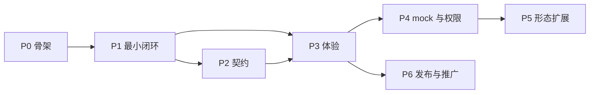

# DDE DBus 接口测试框架 —— 开发文档

> 配套文档:`dbus-testing-design.md`(设计方案 v4,含背景/选型/分档依据/实测证据)
> 本文档是**可直接照做的实现规格与开发流程**:API 签名、算法、错误码、任务与验收标准均可落地执行。
> 版本:dev-v1 · 日期:2026-09-03

---

# 第 0 部分 · 如何使用本文档

| 角色 | 读什么 |
|---|---|
| 实现者 | 第 1 部分(不可协商约束)→ 第 2 部分(实现规格)逐模块照做 → 第 3 部分按阶段推进 |
| 评审者 | 第 1 部分 + 3.5(阶段验收) |
| 接入者(各仓) | 1.5 接入契约 + `docs/` 三篇(五分钟接入 / 原语参考 / 诊断手册) |

**开发纪律(四条硬规则)**

1. **语言无关**与**不侵入业务代码**是**不可协商**约束,任何实现不得违反;违反项按 1.3/1.4 的自动检查拦截。
2. 任何"档位判定""形态支持"**必须由实测认定**,不得由源码推断入库(反例见附录 A.2)。
3. 所有面向用户的失败**必须经 `diagnose` 出口**,给出错误码 + 可操作提示;裸 traceback 视为缺陷。
4. 配置 schema 变更**必须走 `apiVersion`**,不得让已接入仓被动改配置。

---

# 第 1 部分 · 不可协商约束与接入契约

## 1.1 产品定义

一个 Python 工具/框架,让 21 个 DDE 仓以**纯配置**方式,对**刚构建出的二进制**在**私有总线**上做 DBus 接口自动化测试,产出 CI 可消费的报告。体验与 `ctest` / `go test` 同级。

## 1.2 两条不可协商约束

### 约束 ① 语言无关:被测服务可以是任何语言

**成立机理**:DBus 是语言无关 IPC;框架**只经总线**与被测进程对话,从不链接、不注入、不感知被测语言运行时。

| 实现层面的体现 | 要求 |
|---|---|
| 交互面 | 仅 `org.freedesktop.DBus.*`(Introspectable / Properties / Peer)与业务接口的标准 DBus 调用 |
| 接入物 | 各仓 `tests/dbus/` 只含 YAML + XML;**禁止**要求各仓提供任何语言的胶水代码 |
| 二进制处理 | 只 `exec` 一个路径 + 环境变量;**禁止**按语言分支处理(除 `kind` 的 argv 差异,那是宿主形态差异而非语言差异) |
| 已验证 | Go 服务(Pinyin1/Graphic1)、C++/Qt 服务(AM/Appearance1)、Go loader 模块(SystemInfo1)三形态均可 introspect(附录 A.2、A.7) |

**关于 `hosts/dsm-host`(唯一的 C++ 组件)**:它是**框架侧**的 DSM 宿主替身,用于 `dlopen` 被测插件 `.so`——因为 DSM 插件本身就是 C++/Qt 动态库,这是**被测物的形态约束**,不是框架对语言的要求。核心包保持纯 Python;该组件独立打包、按需安装;不安装时 `kind: dsm` 自动降级为 `attach`。**不违反约束 ①。**

### 约束 ② 不侵入业务逻辑代码:不修改被测项目代码(可添加 test/ 代码)

| 维度 | 规定 |
|---|---|
| 业务代码 | **只读不写**。框架可以*读*仓内源码声明 XML(`api/dbus/*.xml`)做静态比对;**任何情况下不写入业务代码路径** |
| 构建系统 | **不调用**。框架从不执行 `cmake`/`make`/`ninja`/`go build`/`dpkg-buildpackage`;只**消费**已有构建产物路径 |
| 允许写入 | **仅** `tests/dbus/`(由 `init` 生成骨架),或 `--out` 指定的仓外目录 |
| 可选的一行 | `tests/CMakeLists.txt` 里 `add_test(...)` —— 位于 test 目录内,属允许范围,且是**可选**的 |

**自动检查(P0 即接入 CI,防止实现期漂移)**

```bash
# 检查 1:框架代码中禁止出现构建命令调用
! grep -rnE '\b(cmake|ninja|dpkg-buildpackage|go build|make)\b' dbus_testing/ --include='*.py' \
    | grep -vE '^\S+:\s*#|docstring'

# 检查 2:写文件操作只允许出现在 scanner/draft.py 与 report/ 中
grep -rln -E '\b(open\([^)]*[\"'"'"']w|Path\.write_text|write_bytes|os\.remove|shutil\.rmtree)' \
    dbus_testing/ --include='*.py' | grep -vE 'scanner/draft\.py|report/|core/(bus|sandbox)\.py'
# 期望输出为空;core/bus.py 与 core/sandbox.py 的写入被限定在系统临时目录(单测断言)
```

**单测断言**:`tests/test_noninvasive.py`
- 用只读挂载(或 `chmod a-w` 的临时仓副本)跑完整 `run` 流程,断言全程无写入失败——证明框架不写被测仓;
- 断言 `Sandbox` 与 `PrivateBus` 创建的所有路径都在 `tempfile.gettempdir()` 之下;
- 断言 `init --out` 指向仓外时,被测仓目录 mtime 不变。

## 1.3 两个正交轴(实现时勿混淆)

- **轴 1 · 二进制来源**:构建产物(`binary.search` + `${BUILD_DIR}`)。纯路径解析。
- **轴 2 · 运行环境**:`isolate`(私有总线 + mock,主线)/ `attach`(接真实会话,只读兜底)。难点全在此轴,取决于服务外部依赖数量。

## 1.4 白盒语义(实现落点)

"以源码知识为依据的接口级测试" = **三方一致性校验**:

```
仓内源码声明 XML(只读) ──┐
                          ├─→ check --static(不起服务,秒级)
        contract.xml     ──┤
                          └─→ check(起服务,运行时 introspect)
```

## 1.5 接入契约(框架对各仓的唯一要求)

```
<repo>/tests/dbus/
├── service.yaml     # 必需
├── contract.xml     # 必需(init/scan 生成 + 人工审)
├── tests.yaml       # 可选(无则只跑契约校验)
└── test_extra.py    # 可选(逃生舱)
```

---

# 第 2 部分 · 实现规格

## 2.1 代码结构(照此建目录)

```
deepin-dbus-testing/
├── dbus_testing/
│   ├── cli.py                    # argparse 子命令入口
│   ├── errors.py                 # 异常层次 + 错误码
│   ├── model.py                  # 配置数据类 + 加载/校验(apiVersion 分派)
│   ├── engine.py                 # 用例编译与执行
│   ├── core/
│   │   ├── bus.py                # PrivateBus
│   │   ├── sandbox.py            # Sandbox
│   │   ├── launcher.py           # Launcher / ServiceHandle / kind handlers
│   │   ├── mockdeps.py           # MockDeps
│   │   ├── client.py             # BusClient / CallResult / 信号捕获
│   │   ├── guard.py              # AttachGuard
│   │   └── diagnose.py           # Diagnosis / RULES
│   ├── scanner/
│   │   ├── introspect.py  ├── normalize.py  ├── diff.py
│   │   ├── srcxml.py      └── draft.py
│   ├── report/{junit,html,jsonout}.py
│   ├── mocktemplates/            # DDE 专有 mock 模板(dbusmock 格式)
│   └── pytest_plugin.py
├── hosts/dsm-host/               # 可选 C++ 组件(§2.9)
├── tests/{fixtures/,test_*.py}   # 框架自测
├── examples/{pinyin1,graphic1}/  # 样板配置
├── docs/{quickstart,primitives,diagnose}.md
├── debian/ · pyproject.toml
```

## 2.2 数据模型(`model.py`)

```python
API_VERSIONS = {"v1"}

@dataclass(frozen=True)
class SandboxSpec:
    home: Literal["tmp", "inherit"] = "tmp"
    env: Mapping[str, str] = field(default_factory=dict)

@dataclass(frozen=True)
class MockSpec:
    template: str                      # dbusmock 内置名 / mocktemplates 名 / 服务名
    bus: Literal["session", "system"] = "session"
    params: Mapping[str, Any] = field(default_factory=dict)

@dataclass(frozen=True)
class ReadySpec:
    name_owner: tuple[str, ...]        # 全部就绪才算 READY
    timeout: float = 10.0

@dataclass(frozen=True)
class AuthSpec:
    polkit: tuple[tuple[str, tuple[str, ...]], ...] = ()   # (interface, methods)

@dataclass(frozen=True)
class IgnoreSpec:
    paths: tuple[str, ...] = ()
    interfaces: tuple[str, ...] = ("org.freedesktop.DBus.*",)
    methods: tuple[str, ...] = ()

@dataclass(frozen=True)
class ServiceSpec:
    api_version: str
    process: str
    mode: Literal["isolate", "attach"] = "isolate"
    kind: Literal["process", "dsm", "plugin-host", "go-loader"] = "process"
    services: tuple[str, ...] = ()
    binary_search: tuple[str, ...] = ()
    plugin: str | None = None
    module: str | None = None          # go-loader:要启用的模块名
    args: tuple[str, ...] = ()
    sandbox: SandboxSpec = SandboxSpec()
    needs: tuple[MockSpec, ...] = ()
    system_bus: bool = False
    ready: ReadySpec = ...
    auth: AuthSpec = AuthSpec()
    allow_methods: tuple[str, ...] = ()      # attach allowlist
    ignore: IgnoreSpec = IgnoreSpec()
    src_xml_globs: tuple[str, ...] = ("api/dbus/*.xml", "xml/*.xml", "dbus/*.xml")
    teardown: Literal["kill", "term"] = "kill"
    isolation: Literal["per-run", "per-case"] = "per-run"
    restart: Literal["never", "per-case"] = "never"
    source: Path = ...
```

**加载规则**
- `load_service(path, build_dir) -> ServiceSpec`:读 YAML → 校验 `apiVersion ∈ API_VERSIONS`(否则 `ConfigError`)→ 展开变量 → 构造 frozen dataclass。
- **未知字段一律报错**(拼写错误必须早失败),不静默忽略。
- 变量表:`${BUILD_DIR}`、`${REPO_ROOT}`、`${TESTS_DIR}`、`${ENV:NAME}`。

```python
@dataclass(frozen=True)
class Expect:
    signature: str | None = None
    value: Any = _UNSET
    type: str | None = None
    error: str | None | _Unset = _UNSET   # None=必须无错 / "*"=任意错 / "名"=指定错 / 未写=隐含无错
    nonempty: bool | None = None

@dataclass(frozen=True)
class Target:
    service: str; path: str; interface: str; member: str

@dataclass(frozen=True)
class Step:
    op: Literal["call","get-prop","set-prop","wait-signal","check-contract","mock-state"]
    target: Target | None
    args: tuple[Any, ...] = ()
    value: Any = None
    timeout: float | None = None
    expect: Expect = Expect()

@dataclass(frozen=True)
class Case:
    name: str; steps: tuple[Step, ...]; flaky: int = 0; line: int = 0
```

**Target 省略解析**(让 T1 用例只写 `method`):`service` 缺省取 `services[0]`;`path` 缺省由服务名转路径(`org.deepin.dde.Pinyin1` → `/org/deepin/dde/Pinyin1`);`interface` 缺省等于 `service`。

## 2.3 错误与退出码(`errors.py`)

```python
class DbusTestingError(Exception): code: str
class ConfigError(...):     code = "E_CONFIG_INVALID"
class BinaryNotFound(...):  code = "E_BINARY_NOT_FOUND"
class ProcessDied(...):     code = "E_PROC_DIED"
class ReadyTimeout(...):    code = "E_READY_TIMEOUT"
class MockUnfaithful(...):  code = "E_MOCK_UNFAITHFUL"
class ContractDrift(...):   code = "E_CONTRACT_DRIFT"
class GuardDenied(...):     code = "E_GUARD_DENIED"
class SignalTimeout(...):   code = "E_SIGNAL_TIMEOUT"
class CallTimeout(...):     code = "E_CALL_TIMEOUT"
class BusError(...):        code = "E_BUS"
```

**CLI 退出码**(CI 依赖,不可随意变更)

| 码 | 含义 |
|---|---|
| 0 | 全部通过 |
| 1 | 用例失败或契约漂移 |
| 2 | 配置错误(`E_CONFIG_INVALID` / `E_GUARD_DENIED`) |
| 3 | 环境错误(`E_BINARY_NOT_FOUND` / `E_PROC_DIED` / `E_READY_TIMEOUT` / `E_MOCK_UNFAITHFUL`) |
| 4 | 框架内部错误 |

## 2.4 `core/bus.py`

```python
class BusType(Enum): SESSION="session"; SYSTEM="system"

class PrivateBus:
    def __init__(self, bus_type: BusType, *, servicedirs: bool = False): ...
    def start(self) -> str          # 返回 address
    def stop(self) -> None
    @property
    def address(self) -> str
    @property
    def env(self) -> dict[str, str] # {DBUS_SESSION_BUS_ADDRESS: addr} 或 SYSTEM
    def __enter__/__exit__
```

**实现要点(均有实测依据)**

1. 生成临时配置启动,**默认不含标准 servicedir**:
   ```xml
   <busconfig>
     <type>session</type><keep_umask/>
     <listen>unix:path=$TMP/bus.socket</listen>
     <servicedir>$TMP/services</servicedir>
     <policy context="default">
       <allow send_destination="*" eavesdrop="true"/><allow eavesdrop="true"/><allow own="*"/>
     </policy>
   </busconfig>
   ```
   **理由**:实测 AM 在带标准 servicedir 的私有总线上触发 `org.freedesktop.systemd1` 的 DBus 激活并失败(附录 A.1)。密闭测试必须禁止意外激活真实服务。
2. 启动:`dbus-daemon --config-file=<cfg> --print-address=1 --print-pid=1 --nopidfile --fork`;读首行地址、次行 pid。
3. **不用 `dbus-run-session` 包裹**(实测 teardown 挂起,附录 A.5)。
4. `stop()`:`SIGTERM` → 1s 未退 `SIGKILL`;捕获 `PermissionError` 降级放行并记 WARNING(附录 A.9)。
5. 所有临时文件在 `tempfile.gettempdir()` 之下(约束 ② 单测会断言)。
6. system 变体只改 `<type>` 与环境变量名;libdbus/GDBus/godbus 均读 `DBUS_SYSTEM_BUS_ADDRESS`。

## 2.5 `core/sandbox.py`

```python
class Sandbox:
    def __init__(self, spec: SandboxSpec): ...
    def __enter__(self) -> dict[str, str]   # 返回注入子进程的 env 增量
    def __exit__(self, *exc) -> None        # 清理;--keep-bus 时保留并打印路径
```

`home="tmp"`:`mkdtemp()` 并导出 `HOME`、`XDG_DATA_HOME`、`XDG_CONFIG_HOME`、`XDG_CACHE_HOME`、`XDG_RUNTIME_DIR`(0700),再叠加 `spec.env`。`XDG_DATA_DIRS` 保持继承(服务需读系统 desktop 文件)。

## 2.6 `core/launcher.py`

```python
@dataclass
class ServiceHandle:
    spec: ServiceSpec; process: subprocess.Popen | None
    resolved_binary: Path | None; bus_address: str; services: tuple[str, ...]
    def is_alive(self) -> bool          # process.poll() is None
    def stderr_tail(self, n: int = 20) -> str
    def terminate(self) -> None

class Launcher:
    def resolve_binary(self, spec, build_dir: Path | None) -> Path
    def build_argv(self, spec, binary: Path) -> list[str]
    def launch(self, spec, bus_env, sandbox_env) -> ServiceHandle
    def wait_ready(self, handle, client: BusClient) -> None
```

**`resolve_binary`**:按 `binary_search` 顺序取第一个 `exists() and is_file()`;全不中 → `BinaryNotFound`,异常携带**每条候选及判定结果**(诊断要用)。

**`build_argv` 按 kind 分派**

| kind | argv | 依据 |
|---|---|---|
| `process` | `[binary, *args]` | 已实测(附录 A.2) |
| `go-loader` | `[binary, "--enable", spec.module, "-i", *args]` | `dde-session-daemon` 有 `--enable/--disable/--list/-i/-f`(附录 A.8) |
| `dsm` | `[dsm_host, "--plugin", plugin, "--name", svc, "--bus", addr]` | 自建宿主替身,§2.9 |
| `plugin-host` | `[host_binary, "-p", plugin, *args]` | ⚠ 待实测(附录 B.1) |

**`launch`**:`stdout=PIPE, stderr=STDOUT`,后台线程持续读入环形缓冲(200 行)——**必须读**,否则管道写满会阻塞子进程;`start_new_session=True` 便于整组回收。

**`wait_ready` 算法**

```
deadline = now + spec.ready.timeout
loop:
    if not handle.is_alive(): raise ProcessDied(exit_code, handle.stderr_tail(20))
    if all(client.name_has_owner(n) for n in spec.ready.name_owner): return
    if now > deadline: raise ReadyTimeout(expected=spec.ready.name_owner,
                                         actual=client.list_acquired_names())
    sleep(0.1)
```

**禁止 `pgrep` 判存活**(实测假阳性,附录 A.4):只用 Popen 句柄 + name-owner 双判。

## 2.7 `core/client.py`

```python
@dataclass(frozen=True)
class CallResult:
    ok: bool; value: Any; signature: str
    error_name: str | None; error_message: str | None; elapsed: float

class BusClient:
    def __init__(self, address: str)             # dbus.bus.BusConnection(address)
    def name_has_owner(self, name) -> bool
    def list_acquired_names(self) -> list[str]
    def introspect(self, service, path, timeout=5.0) -> str
    def walk(self, service, root="/") -> Iterator[tuple[str, str]]
    def call(self, t: Target, args, timeout=5.0) -> CallResult
    def get_prop(self, t, timeout=5.0) -> CallResult
    def set_prop(self, t, value, timeout=5.0) -> CallResult
    @contextmanager
    def capture(self, t, signal) -> Iterator[list[Any]]
    def close(self) -> None
```

**实现要点**

1. **签名获取必须用低层 API**:
   ```python
   msg = dbus.lowlevel.MethodCallMessage(dest, path, iface, member)
   msg.append(*args, signature=sig_or_None)
   reply = conn.send_message_with_reply_and_block(msg, timeout_ms)
   signature = reply.get_signature(); value = to_native(reply.get_args_list())
   ```
2. **`to_native`**:`dbus.String→str`、`Array→list`、`Dictionary→dict`、`Boolean→bool`、`Int*/UInt*→int`、`Double→float`、`ObjectPath→str`、`Struct→tuple`、`Byte→int`、`Signature→str`,递归。**值断言前双方都过 `to_native`**。
3. **信号捕获必须单线程**:
   ```python
   DBusGMainLoop(set_as_default=True)
   def wait_until(pred, timeout):
       ctx = GLib.MainContext.default(); end = monotonic() + timeout
       while monotonic() < end:
           if pred(): return True
           ctx.iteration(may_block=False); sleep(0.01)
       return pred()
   ```
   **禁止**后台线程跑 MainLoop:实测与主线程阻塞调用并发会 SIGSEGV(附录 A.6)。
4. **`walk`**:递归解析 `<node name=...>` 拼路径;命中 `ignore.paths` 的分支不展开,记为模式节点;深度上限 32 防环。
5. `attach` 模式下所有写操作先过 `AttachGuard`。

## 2.8 `core/guard.py`

```python
class AttachGuard:
    def __init__(self, spec: ServiceSpec): ...
    def check(self, step: Step) -> None    # 违规 raise GuardDenied
```

`mode == "attach"`:`introspect` / `get-prop` / `check-contract` 恒允许;`call` / `set-prop` / `mock-state` **必须** `f"{iface}.{member}"` 命中 `allow_methods`(fnmatch),否则 `GuardDenied`。`isolate` 恒放行。
`GuardDenied` 用例记为**配置错误**,不计失败(§2.13)。

## 2.9 `hosts/dsm-host`(可选 C++ 组件)

**问题**:deepin-service-manager 的配置目录是**编译期宏 `SERVICE_CONFIG_DIR`**,无运行时重定向(CLI 仅 `-g/-n/-s/--elf-qt-version-check`),无法让它加载 `${BUILD_DIR}` 的 `.so`。

**方案**:框架自带最小宿主替身(约 60 行 C++/Qt6)。插件 ABI 已确认:

```c
typedef int (*DSMRegister)(const char *name, void *data);   // data 实为 QDBusConnection*
```

流程:`QDBusConnection::connectToBus(addr, tag)` → `dlopen(plugin)` → `dlsym("DSMRegister")` → `func(name, new QDBusConnection(conn))` → `registerService(name)` → 事件循环。

**兼容性**:部分插件(如 dde-appearance)在 `DSMRegister` 内直接用 `QDBusConnection::sessionBus()` 而非传入连接——此时只要 `DBUS_SESSION_BUS_ADDRESS` 指向私有总线即自然生效。两种写法都覆盖。

**边界**:框架**唯一** C++ 件,独立打包 `dbus-testing-dsm-host`,按需安装;核心包纯 Python;不安装则 `kind: dsm` 降级 `attach`。见 §1.2 约束 ① 的说明。

## 2.10 `core/mockdeps.py`

```python
class MockDeps:
    def __init__(self, specs: tuple[MockSpec, ...]): ...
    def start(self, session_addr: str, system_addr: str | None) -> None
    def stop(self) -> None
    def set_state(self, template: str, method: str, args) -> None   # mock-state 原语
```

用 `dbusmock.SpawnedMock.spawn_with_template(template, params, bustype)`;`mocktemplates/` 内自定义模板走路径形式加载。

**顺序强制**:`MockDeps.start()` 必须在 `Launcher.launch()` **之前**完成(实测:依赖缺失会让被测服务直接 abort,附录 A.1)。

**不保真检测**:mock 进程 stderr 出现 `UnknownMethod: <X> is not a valid method of interface <I>` → `MockUnfaithful(missing=[I.X])`,由 diagnose 输出待补方法名与模板片段。

## 2.11 `scanner/`

### `introspect.py`
`snapshot(client, services, ignore) -> ObjectTree`:每个服务名从 `/` 起 `walk`,收集 `{path: xml}`。

### `normalize.py`(diff 稳定性关键,严格照做)

```
normalize(xml_text, ignore) -> str
1. ElementTree 解析
2. 删除 <annotation>、注释、纯空白文本
3. 丢弃 interface:name 命中 ignore.interfaces(fnmatch)
4. 丢弃 method/property/signal 全名命中 ignore.methods
5. 排序:interface 按 name;interface 内先 method、再 signal、再 property,各按 name
   ⚠ <arg> 保持声明顺序(顺序是语义,不可排序)
6. 标签属性按 (name, type, access, direction) 固定顺序输出
7. 2 空格缩进,UTF-8,行尾 \n
```

`normalize_tree(tree, ignore)`:路径按字典序;命中 `ignore.paths` 的兄弟路径归并为单个 `<node name="PATTERN"/>`。

### `srcxml.py`
按 `src_xml_globs` 收集仓内源码声明 XML(**只读**),按 `<interface name>` 建索引供 `--static` 比对。**无源码 XML 时输出 SKIP**(不是失败),报告标注该仓无源码声明可比。

### `diff.py`

```python
@dataclass(frozen=True)
class Delta:
    kind: Literal["added","removed","changed"]
    scope: Literal["interface","method","signal","property","arg","path"]
    path: str; interface: str; member: str | None
    before: str | None; after: str | None

def diff(baseline: str, actual: str) -> list[Delta]
```

成员集合差 → added/removed;同名成员签名/access/参数序列不同 → changed(`before`/`after` 存原始签名串)。`ContractDrift` 携带 `deltas`,报告渲染为表格 + 原始 XML diff。

### `draft.py`(`init` 的核心价值)

```python
def draft_tests(tree: ObjectTree, ignore) -> str      # 生成 tests.yaml 文本
def draft_service(probe: ProbeResult) -> str          # 生成 service.yaml 文本
```

草稿规则(生成物一律加 `#` 前缀,文件头写"取消注释即生效"):

| 成员形态 | 草稿用例 |
|---|---|
| 方法,无入参,有出参 | `call` + `expect.signature: <out_sig>` — **可直接启用** |
| 方法,有入参 | `call` + 按类型填占位 `args` + `expect: {error: "*"}`,注释提示补真实参数 |
| 属性 read | `get-prop` + `expect.type: <type>` — **可直接启用** |
| 属性 readwrite | 追加往返读写用例(注释态) |
| 属性 只读 | 追加 `set-prop` + `expect.error: org.freedesktop.DBus.Error.PropertyReadOnly` |
| 信号 | 注释态 `wait-signal` 模板,提示填触发方法 |
| 文件末尾 | 固定追加 `- name: contract` / `check-contract: true` |

**验收指标**:对 Pinyin1/Graphic1,可直接启用用例数 ≥ 方法与属性总数的 60%。

## 2.12 `engine.py`

```python
@dataclass
class RunContext:
    spec: ServiceSpec; client: BusClient; handle: ServiceHandle | None
    guard: AttachGuard; mocks: MockDeps | None; baseline: str; ignore: IgnoreSpec

@dataclass
class StepResult: step: Step; ok: bool; detail: str; result: CallResult | None
@dataclass
class CaseResult: case: Case; status: Literal["pass","fail","error","config-error","skip"]
                  steps: list[StepResult]; elapsed: float; attempts: int
@dataclass
class RunResult:  cases: list[CaseResult]; contract: list[Delta]
                  env: dict[str,str]; coverage: CoverageMatrix

class Engine:
    def compile(self, tests_path: Path, spec: ServiceSpec) -> list[Case]
    def run(self, cases, ctx) -> RunResult
```

**断言求值顺序(必须按此)**

```
1. error 维度先判:
   未写 / None → result.ok 必须 True,否则 fail(附错误名+消息)
   "*"         → result.ok 必须 False
   "<name>"    → error_name 严格相等
2. 期望出错且确实出错 → 其余断言跳过(无返回值可断)
3. signature → 严格字符串相等
4. type      → 单返回值取类型码比较;多返回值报配置错误
5. value     → to_native 深度相等
6. nonempty  → len>0(str/list/dict),标量则 truthy
```

**执行策略**
- 用例按声明顺序串行;`isolation: per-case` 时每例重建总线+服务;
- `flaky: N` 才重试(≤N 次),报告标 `flaky`,退出码按最终结果;
- 任一 step 抛 `GuardDenied` → 整例 `config-error`(不计失败);
- `check-contract` step:`diff(baseline, normalize(snapshot()))`,非空即 fail 并挂到 `RunResult.contract`。

**覆盖矩阵**

```python
CoverageMatrix = dict[str, dict[str, MemberCoverage]]   # interface -> member
@dataclass
class MemberCoverage:
    declared: Literal["ok","only-src","only-baseline","only-runtime","mismatch","unknown"]
    executed_by: list[str]
```

`declared` 来自源码 XML / baseline / runtime 三方存在性与签名一致性;`executed_by` 在 `compile` 时从各 step 的 `Target` 收集 `(interface, member)` 反查——**无需人工标注**。

## 2.13 `report/`

- **junit.py**:`<testsuite name="dbus-interface" tests= failures= errors= skipped= time=>`;每例 `<testcase classname="<service>" name="<case>">`;失败 `<failure message type=E_XXX>` 含 detail;`config-error` 用 `<error>`;环境指纹写 `<properties>`(二进制解析路径、总线地址、构建目录、mode、tier)。
- **jsonout.py**:`RunResult` 全量 dump(deltas、coverage、每 step 结果与耗时)。
- **html.py**:**零第三方依赖**——Python 侧渲染静态表格 + 内联 CSS,并把 `results.json` 以 `<script type="application/json">` 内嵌。三段:概要 / 覆盖矩阵(声明 × 执行两栏)/ 用例明细(含 `tests.yaml:行号`、XML diff 表)。

## 2.14 `core/diagnose.py`

```python
@dataclass(frozen=True)
class Diagnosis: code: str; summary: str; detail: str; hint: str
def diagnose(exc: DbusTestingError, ctx) -> Diagnosis
```

**规则表(实现即照此)**

| 触发 | code | detail | hint |
|---|---|---|---|
| `BinaryNotFound` | E_BINARY_NOT_FOUND | 每条候选路径 + 存在性 | 检查 `--build-dir` 或先构建;候选来自 `binary.search` |
| `ProcessDied` + stderr 含 `platform plugin`/`could not connect to display` | E_PROC_DIED | 退出码 + stderr 尾 20 行 | 在 `sandbox.env` 加 `QT_QPA_PLATFORM=offscreen` |
| `ProcessDied` + stderr 含 `org.freedesktop.systemd1`/`ConfigManager` | E_PROC_DIED | 同上 | 该依赖缺失即 abort:在 `needs:` 前置对应 mock |
| `ProcessDied` 其它 | E_PROC_DIED | 同上 | 用 `--keep-bus` 保留环境后手工复现 |
| `ReadyTimeout` 且有别的名字 | E_READY_TIMEOUT | 期望 vs 实际已注册名字 | `services:`/`ready.name-owner` 写错,改为实际名字 |
| `ReadyTimeout` 且无任何名字 | E_READY_TIMEOUT | 同上 + stderr 尾 | 转按 E_PROC_DIED 排查;或调大 `ready.timeout` |
| `MockUnfaithful` | E_MOCK_UNFAITHFUL | 缺失方法全名列表 | 在 `mocktemplates/<svc>.py` 补方法(给 `AddMethod` 片段),按贡献流程回贡 |
| `ContractDrift` | E_CONTRACT_DRIFT | deltas 表 | 有意变更 → `scan --emit` 更新基线并 review;否则是回归 |
| `GuardDenied` | E_GUARD_DENIED | 被拒方法名 | `attach` 默认只读;确需调用加入 `allow.methods`(注意破坏性风险) |
| `SignalTimeout` | E_SIGNAL_TIMEOUT | 已收到的信号列表 | 检查信号名与触发方法;或调大 timeout |
| `CallTimeout` | E_CALL_TIMEOUT | 目标 + 超时值 | 服务可能阻塞;`--keep-bus` 后手工 `busctl call` 复现 |

## 2.15 `cli.py`

```
dbus-testing init  [--binary P | --from-running SVC] [--out tests/dbus] [--build-dir D]
dbus-testing scan  <dir> [--build-dir D] [--emit]
dbus-testing check <dir> [--static] [--build-dir D] [--report O]
dbus-testing run   <dir> [--build-dir D] [--report O] [-k EXPR]
公共:--verbose  --keep-bus  --shell  --timeout-scale F  --json
```

- `init` 是**唯一写入被测仓的命令**,且只写 `tests/dbus/`(或 `--out` 指定的仓外目录)——见约束 ②;
- `--keep-bus`:跑完不清理,打印 `export DBUS_SESSION_BUS_ADDRESS=...` 与 sandbox 路径;
- `--shell`:进入注入总线环境变量的 `$SHELL`;
- `--timeout-scale`:慢机器/CI 统一放大超时(不改配置);
- 异常统一在 `main()` 出口过 `diagnose()` 打印,再按 §2.3 映射退出码。

## 2.16 `pytest_plugin.py`

采用**自定义 Collector**(比 `pytest_generate_tests` 更适合 YAML,天然支持 file:line):

```python
def pytest_addoption(parser): parser.addoption("--dbus-build-dir", ...)

def pytest_collect_file(file_path, parent):
    if file_path.name == "tests.yaml":
        return YamlFile.from_parent(parent, path=file_path)

class YamlFile(pytest.File):
    def collect(self):
        spec = load_service(self.path.parent / "service.yaml", build_dir=...)
        for case in Engine().compile(self.path, spec):
            yield YamlCase.from_parent(self, name=case.name, case=case)

class YamlCase(pytest.Item):
    def runtest(self): ...                 # 复用 Engine 单例执行
    def repr_failure(self, excinfo): ...   # 打印 diagnose 的 summary/detail/hint
    def reportinfo(self): return self.path, self.case.line, self.name
```

fixtures:`dbus_bus`(session 域私有总线)、`dbus_service`(按 `service.yaml` 拉起,session 域)、`signal_wait`。

---

# 第 3 部分 · 开发流程

## 3.1 环境准备

```bash
# 运行时依赖(deepin 25 自带前两项)
sudo apt install python3-dbus python3-gi dbus-daemon
python3 -m pip install --user python-dbusmock pytest pyyaml
# 开发工具
python3 -m pip install --user ruff mypy build
```

最低 Python 3.11;目标 3.12(deepin 25 自带)。

## 3.2 工程约定

| 项 | 约定 |
|---|---|
| 风格 | `ruff format` + `ruff check`;行宽 100 |
| 类型 | 全量注解;`core/` 与 `model.py` 过 `mypy --strict` |
| 依赖 | 运行时仅 `dbus-python`、`PyGObject`、`PyYAML`;`pytest`、`python-dbusmock` 为 extras |
| 日志 | `logging` 模块级 logger;`--verbose` → DEBUG(总线地址、解析二进制、mock 启动顺序、每调用耗时) |
| 错误 | 用户可见失败必须经 `diagnose`;禁止裸 traceback |
| 约束守卫 | CI 跑 §1.2 的两条 grep 检查 + `tests/test_noninvasive.py` |
| 提交 | 一阶段一 PR,必带该阶段自测用例 |

## 3.3 实现顺序



## 3.4 阶段任务与验收

### P0 · 骨架(0.5 天)
- [ ] 建仓与目录(§2.1)、`pyproject.toml`、ruff/mypy、CI(容器内 pytest)
- [ ] `errors.py`、`model.py`(v1 加载 + 校验 + 变量展开)
- [ ] fixture 服务 `fx_echo`(§3.5)
- [ ] **约束守卫**:两条 grep 检查 + `tests/test_noninvasive.py` 接入 CI
- **验收**:`pytest tests/test_model.py` 绿;非法 `apiVersion`/未知字段报 `E_CONFIG_INVALID`;约束检查在 CI 生效

### P1 · 最小闭环(1 天)· 关键里程碑
- [ ] `core/bus.py`(私有 session 总线,无标准 servicedir)
- [ ] `core/sandbox.py`
- [ ] `core/launcher.py`(`process` kind + `resolve_binary` + `wait_ready`)
- [ ] `core/client.py`(`call`/`get_prop`/低层签名/`to_native`)
- [ ] `engine.py`(`call`/`get-prop`/`set-prop` + 五断言求值)
- [ ] `cli.py run` + `report/junit.py` + 终端输出
- **验收(硬指标)**:
  1. `fx_echo` 全原语用例绿;
  2. **Pinyin1 与 Graphic1 从 `--build-dir` 指向的构建产物密闭跑通**(同时验证 `binary.search` 这一未验证环节,附录 B.3);
  3. `junit.xml` 通过 JUnit schema 校验;退出码符合 §2.3

### P2 · 契约(1 天)
- [ ] `scanner/introspect.py`、`normalize.py`(§2.11 七步,逐步单测)、`diff.py`、`srcxml.py`
- [ ] `cli scan --emit`、`check`、`check --static`;`check-contract` 原语
- **验收**:
  1. 同一服务连续两次 `scan` 产物**逐字节相同**;
  2. 人为改基线(删方法/改签名/改 access)→ diff 精确定位三类 delta;
  3. AM 仓 `check --static` 能与其 `api/dbus/*.xml` 比出结果(不拉起服务);无源码 XML 的仓输出 SKIP

### P3 · 体验(1.5 天)
- [ ] `core/diagnose.py` 规则表全量、`scanner/draft.py` + `cli init`、`core/guard.py` + `attach`
- [ ] `report/html.py` + 覆盖矩阵、`--keep-bus`/`--shell`/`--timeout-scale`、`pytest_plugin.py`
- **验收**:
  1. 每条诊断规则都有 fixture 触发的自测;
  2. `init` 对 Pinyin1 生成的配置**不改**即可 `run` 通过,可直接启用用例占比 ≥60%;
  3. `attach` 下未放行方法被拒且计 config-error;
  4. HTML 覆盖矩阵声明/执行两栏正确

### P4 · mock 与权限(1.5 天)
- [ ] `core/mockdeps.py`(顺序强制 + 不保真检测)、私有 system bus、`auth.polkit` + polkitd mock
- [ ] `mocktemplates/` 首批(systemd 扩展、ConfigManager)
- **验收(已达成,2026-09-07 实测)**:
  1. `fx_needdep` 报 `E_MOCK_UNFAITHFUL` 并给出缺失方法名;
  2. T2 服务密闭跑通:SystemInfo1(`go-loader --enable systeminfo`)
     与 PasswdConf1(`system-bus: true`,含 polkitd mock)均已验证;
  3. system bus 服务能在私有 system bus 注册(实现要点:`system-bus: true` 时测试客户端与就绪探测必须切到 system bus,初版遗漏已由 PasswdConf1 实测暴露并修复)

### P5 · 形态扩展(2 天)
- [ ] `hosts/dsm-host` + `kind: dsm`;`kind: plugin-host`(先实测宿主参数,附录 B.1)
- [ ] 21 仓逐仓实测建档(T1/T2/T3),产出分档看板
- **验收**:dde-appearance 用自建 `.so` 密闭注册成功;看板覆盖 21 仓

### P6 · 发布与推广(1 天)
- [ ] `debian/` 打包(`python3-dbus-testing`、`dbus-testing-dsm-host`)+ pip;`docs/` 三篇 + `examples/` 两套
- [ ] CI 模板(ctest / go test / 流水线片段),门禁灰度 warning-only
- **验收(可用性硬判据)**:**非框架作者**按 `docs/quickstart.md` 独立接入一个 T1 仓,**≤30 分钟**跑绿。不达标则回炉改 `init` 与诊断。

## 3.5 框架自测计划(不依赖 DDE 环境)

fixture 服务全部用 dbus-python 写,放 `tests/fixtures/`:

| fixture | 行为 | 覆盖点 |
|---|---|---|
| `fx_echo` | `Echo(s)→s`、`Sum(ai)→i`、属性 `Counter(i,rw)`/`Name(s,r)`、信号 `Pinged(i)` | 六原语、五断言、to_native、签名获取 |
| `fx_multi` | 单进程注册 3 个服务名 | `services:` 多名字、`ready` 全就绪 |
| `fx_crash` | 打印 `could not load the Qt platform plugin "xcb"` 后 `exit(1)` | E_PROC_DIED + offscreen 提示 |
| `fx_slow` | 延迟 30s 注册 | E_READY_TIMEOUT + 实际名字列表 |
| `fx_wrongname` | 注册与配置不一致的名字 | E_READY_TIMEOUT 的"名字写错"分支 |
| `fx_needdep` | 启动时调 mock 上不存在的方法后 abort | E_MOCK_UNFAITHFUL + 缺失方法名 |
| `fx_readonly` | 只读属性 | `set-prop` 错误路径 |
| `fx_hang` | 方法内 sleep 30s | E_CALL_TIMEOUT |

另设可选集成流水线:装有 DDE 的镜像里跑 `examples/`(Pinyin1、Graphic1)。

## 3.6 CI 接入(各仓)

```yaml
- name: dbus-interface-test          # 置于构建/装包阶段之后
  script:
    - python3 -m pip install --user deepin-dbus-testing
    - dbus-testing check tests/dbus/ --static                      # 秒级,先跑
    - dbus-testing run tests/dbus/ --build-dir build --report artifacts/dbus
  artifacts: [artifacts/dbus/junit.xml, artifacts/dbus/report.html]
```

C++ 仓可改用 `ctest -R dbus-interface`(需在 `tests/CMakeLists.txt` 加一行 `add_test`,属允许范围)。

---

# 第 4 部分 · 附录

## A. 已验证技术事实(实现依据,全部本机实测)

> 被测二进制取自系统安装路径,验证的是"路径 → 私有总线 → 注册 → 调用"机制链;`binary.search` 的构建产物解析在 P1 验收中验证(机制同构)。

1. **依赖必须前置且 mock 需保真**(dde-application-manager 1.2.60.0):无显示 → `could not load the Qt platform plugin "xcb"`;加 `QT_QPA_PLATFORM=offscreen` → SIGABRT,日志 `Process org.freedesktop.systemd1 exited with status 1`;预置 dbusmock 官方 `systemd` 模板后仍 SIGABRT,mock 侧报 `UnknownMethod: Subscribe is not a valid method of interface org.freedesktop.systemd1.Manager`;根因与源码一致:`initService` 依赖失败处 `std::terminate()`。**→ 决定 §2.4 禁用标准 servicedir、§2.10 顺序强制与不保真检测。**
2. **T1 密闭运行成立**:`Pinyin1`(Go)注册成功,introspect 得 `Query(s→as)`/`QueryList(as→s)`,**真实调用** `Query("深度") → ["shendu","shenduo"]`,0.27s;`Graphic1` 注册成功——**推翻"依赖 X11"的静态判断**。**→ 决定"档位只由实测认定"纪律。**
3. **Qt GUI 服务需 `QT_QPA_PLATFORM=offscreen`**。
4. **存活判定禁用 pgrep**:`pgrep -f` 匹配到桌面会话中运行的同名进程,假阳性。**→ §2.6 双判。**
5. **私有总线**:`dbus-daemon --session --fork --nopidfile --print-address=1 --print-pid=1` 稳定;`dbus-run-session` 本机 teardown 挂起。
6. **信号分发必须单线程**:后台线程跑 GLib MainLoop + 主线程阻塞调用 → SIGSEGV;C++/Qt 侧客户端与注册端跨连接同步调用会死锁。**→ §2.7。**
7. **`attach` 只读可行**:真实会话 introspect `ApplicationManager1`(11904B)、`SystemInfo1`(2058B)、`Appearance1`(6021B),三形态 0.23s。
8. **`dde-session-daemon` 支持单模块启用**:`main.go:151` `flag.StringVar(&_options.enable, "enable", ...)`,另有 `--disable`、`--list`、`-i/--ignore`(默认 true)、`-f/--force`。**→ §2.6 go-loader argv。**
9. **本机 dbus-daemon 有信号保护**:SIGTERM 返回 EPERM(普通进程不受限)。**→ §2.4 teardown 降级。**
10. **DSM 无法运行时重定向配置目录**:`SERVICE_CONFIG_DIR` 是编译期宏,CLI 仅 `-g/-n/-s/--elf-qt-version-check`;插件 ABI 为 `int DSMRegister(const char*, void*)`,`data` 实参是 `QDBusConnection*`(`serviceqtdbus.cpp:113-114`)。**→ §2.9 宿主替身方案。**
11. **`SystemInfo1` 非独立进程**:`dpkg -L dde-daemon` 无独立二进制,是 loader 模块;`systeminfo1/info.go:123,127` 调 `dbus.SystemBus()`。**→ 归 T2,用 go-loader kind。**
12. **隔离守卫**:所有测试检查 `DBUS_SESSION_BUS_ADDRESS`,裸跑即 SKIP,防止污染开发桌面总线。

## B. 待实测项(禁止先写实现,先出实测结论)

| # | 问题 | 何时 | 做法 |
|---|---|---|---|
| B.1 | `plugin-host`(dde-shell / dde-tray-loader)如何指向自建 `.so` 且只加载目标插件 | P5 前 | 读宿主 CLI 与插件发现逻辑并试跑;无法定向 → 该形态只支持 `attach` |
| B.2 | DSM 插件在宿主替身下是否完整可用(`sessionBus()` 与传入连接两种写法) | P5 | 用 dde-appearance 的 `.so` 实测 |
| B.3 | `binary.search` 对各仓构建产物布局的命中率 | P1 | 2 个 C++ 仓 + 1 个 Go 仓实测,必要时补默认搜索模式 |
| B.4 | 私有 system bus 上 polkit mock 的授权链是否被服务接受 | P4 | 用 LocaleHelper1 或 PasswdConf1 实测 |
| B.5 | `--enable <module>` 单模块启动的实际最小依赖集 | P4 | 实测 systeminfo 模块 |

## C. 常用命令(开发与排障)

```bash
# 手工起私有总线并保留
export DBUS_SESSION_BUS_ADDRESS=$(dbus-daemon --session --fork --print-address=1 | head -1)

# 查已注册名字(区分 activatable 与 acquired)
busctl --address="$DBUS_SESSION_BUS_ADDRESS" list --acquired

# introspect(XML 形式,与 contract.xml 同格式)
busctl --address="$DBUS_SESSION_BUS_ADDRESS" introspect <svc> <path> --xml-interface

# 直接调用
busctl --address="$DBUS_SESSION_BUS_ADDRESS" call <svc> <path> <iface> <method> <sig> <args>

# 起 dbusmock 模板
python3 -m dbusmock --session <name> <path> <iface>
```
