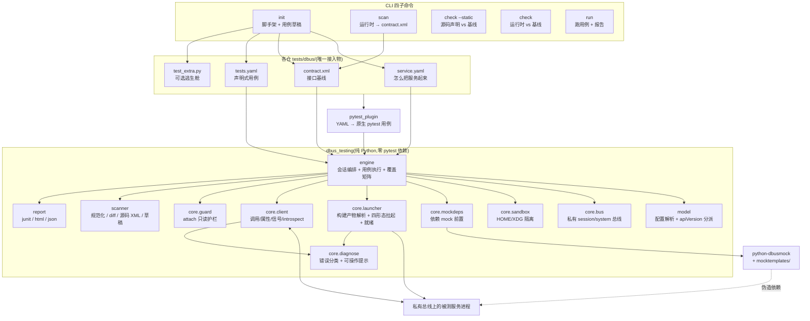
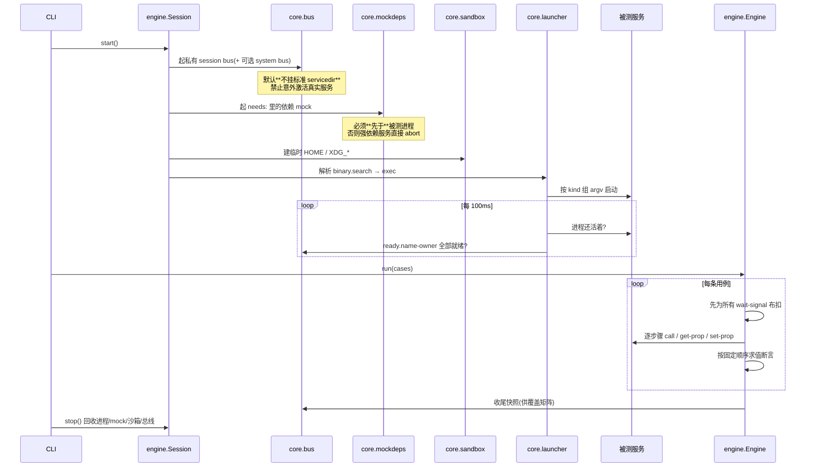

# dbus-testing 完整指南 —— 架构 · 接入 · 使用

> 读这一篇就够。想深挖设计取舍看 [design.md](design.md),想改框架本身看 [development.md](development.md)。
> 本文所有命令输出、路径、字段名均取自实际实现(v0.1.0),不是示意。

---

# 第一部分 · 架构

## 1.1 它解决什么问题

DDE 各仓通过 DBus 对外暴露接口,但这些接口没有机器可读的基线:改签名、误删方法、属性 access 变化,只能靠人肉发现;要测接口就得起隔离总线、mock 外部依赖,每个仓各自踩坑。

dbus-testing 补的是**跨进程契约**这一层:用纯 YAML 描述"服务怎么起来"和"接口该是什么样",对**刚构建出的二进制**在**私有总线**上验证,产出 CI 可消费的报告。它不替代单元测试,和单元测试同级并存。

## 1.2 一个决定架构的事实

**DBus 是语言无关的 IPC——测试客户端的语言与被测服务的语言完全解耦。**

所以框架是**一个 Python 包**,不需要给 C++/Go 各写一套适配层。Go 写的 `Pinyin1`、C++/Qt 写的 `ApplicationManager1`、以 loader 模块形式存在的 `SystemInfo1`、以 `.so` 插件形式存在的 `Appearance1`——**用同一套 YAML 描述**,各仓不需要提供任何语言的胶水代码。

唯一的例外是可选组件 `dsm-host`(60 行 C++),它存在的原因是 DSM 插件本身就是 Qt 动态库——那是被测物的形态,不是框架对语言的要求。

## 1.3 两条不可协商的约束

**① 语言无关。** 交互面只有标准 DBus 调用(`Introspectable` / `Properties` / `Peer` + 业务接口)。框架不链接、不注入、不感知被测语言运行时。

**② 不侵入业务代码。** 框架不改被测项目任何业务代码,**不执行** `cmake`/`make`/`ninja`/`go build`/`dpkg-buildpackage`——只**消费**构建产物的路径。写入范围只有两处:`init` 生成的 `tests/dbus/`,和 `--report` 指定的输出目录。

这两条不是口头承诺,由 CI 里的 `tests/test_noninvasive.py` 守着,共 5 项检查:

| 检查 | 做法 |
|---|---|
| 禁构建命令 | 正则扫全部源码,出现 `cmake`/`go build` 等即失败 |
| 写操作白名单 | 只有 `scanner/draft.py`、`report/`、`core/bus.py`、`core/sandbox.py`、`cli.py` 允许写文件 |
| 不写被测仓 | **把配置目录 `chmod 500` 后跑完整流程**,全程无写入失败 + 文件 mtime 不变 |
| 临时路径受限 | 私有总线与沙箱创建的所有路径必须在 `tempfile.gettempdir()` 下 |
| 仓库洁净 | 跑一轮后不产生额外落盘 |

## 1.4 模块与数据流



## 1.5 一次 `run` 的执行时序(顺序不可颠倒)



三个关键点的实测依据:

1. **私有总线默认不挂标准 servicedir**——实测 AM 在带 servicedir 的私有总线上会触发 `org.freedesktop.systemd1` 的 DBus 激活并失败。密闭测试必须禁止意外激活真实服务。
2. **mock 必须前置**——AM 的 `initService` 在依赖失败处 `std::terminate()`;mock 晚一步就是 SIGABRT。
3. **存活判定用 Popen 句柄 + name-owner 双判,禁用 `pgrep`**——实测 `pgrep -f` 会匹配到桌面会话里同名的真实进程,产生假阳性。

## 1.6 两个正交轴(理解配置的关键)

| 轴 | 选项 | 由谁决定 |
|---|---|---|
| **二进制来源** | 构建产物(`binary.search` + `${BUILD_DIR}`) / 系统安装(兜底) | 纯路径解析,零难度 |
| **运行环境** | `isolate` 私有总线密闭(主线) / `attach` 接真实会话只读(兜底) | **难点全在这里**,取决于服务的外部依赖 |

同一个二进制,来自 `build/` 还是 `/usr/bin` 对能不能跑起来毫无影响;真正的变量是"这个服务依赖多少外部服务"。这就是分档的依据。

## 1.7 服务分档(决定接入顺序)

**档位只由实测认定,不由源码推断。**(反例:静态分析曾判断 Graphic1 依赖 X11,实测在无显示的私有总线上注册成功。)

| 档 | 特征 | 接入成本 | 已验证的例子 |
|---|---|---|---|
| **T1** | 独立二进制、无/极少外部依赖 | 半天 | `Pinyin1`、`Graphic1` |
| **T2** | loader 模块形态,或依赖有现成 mock | 1 天 | `SystemInfo1`(`--enable systeminfo`) |
| **T3** | 强依赖失败即 abort / 插件形态 / 需 root | 数小时~数人日 | `ApplicationManager1`(需 `systemd_dde` mock)、`Appearance1`(需 dsm-host) |

逐服务证据见 [tiers.md](tiers.md)。

## 1.8 白盒语义:三方一致性

框架说的"白盒"是**以源码知识为依据的接口级测试**,不是进程内代码级测试。落地为三方比对:

```
仓内源码声明 XML(api/dbus/*.xml,只读)
        │
        ├── check --static ──→ 不起服务,秒级,T3 也能守
        │
   contract.xml(入仓基线,git 可 diff)
        │
        └── check / check-contract ──→ 起服务 introspect,运行时真值
```

报告里的**声明覆盖**就是这三方是否一致;**执行覆盖**是成员是否真被用例调用过。两者语义不同,分开统计。

---

# 第二部分 · 接入项目

## 2.1 接入物:一个目录

框架对各仓的**全部**要求就是这一个目录,与单元测试同级、随仓版本化、可 code review:

```
<repo>/tests/dbus/
├── service.yaml     # 必需:服务名、构建产物搜索路径、环境、依赖 mock、就绪判定
├── contract.xml     # 必需:接口基线(scan 生成 + 人工审)
├── tests.yaml       # 可选:声明式用例(没有就只跑契约校验)
└── test_extra.py    # 可选:有外部副作用的行为(Python 逃生舱)
```

业务代码零改动。可选的唯一一行改动是 `tests/CMakeLists.txt` 里的 `add_test(...)`,位于 test 目录内,且可以不加。

## 2.2 装框架

```bash
# deb(推荐,deepin 环境)
sudo apt install python3-dbus-testing
sudo apt install python3-dbusmock            # 需要 mock 依赖时
sudo apt install dbus-testing-dsm-host       # 只有 kind: dsm 才需要

# pip(开发调试)
pip install deepin-dbus-testing
```

运行时依赖:`python3-dbus`、`python3-gi`、`python3-yaml`、`dbus-daemon`。

## 2.3 三步接入(T1 服务,约 30 分钟)

### 第一步:`init` 探测并生成骨架

```bash
cd <repo>
cmake --build build                                  # 或 go build -o out/ ./...
dbus-testing init --binary build/hans2pinyin --build-dir build
```

`init` 做的事(这是接入成本能压到 30 分钟的原因):

| 动作 | 产物 |
|---|---|
| 在私有总线上拉起该二进制,记录它注册的**全部**服务名与对象路径 | `service.yaml` 的 `services:` / `ready.name-owner` 自动填好 |
| 拉起失败且输出命中显示相关关键字时,**自动重试** `QT_QPA_PLATFORM=offscreen` 并把生效配置写回 | `sandbox.env` 自动填好 |
| 运行时 introspect,规范化后落盘 | `contract.xml` 基线草稿 |
| 为每个属性生成**可直接启用**的用例;为方法/信号生成带签名提示的注释态草稿 | `tests.yaml` 首批用例 |
| `${BUILD_DIR}` 相对化 | `binary.search` 跨机可复用 |

输出示例:

```
探测结果:服务名 org.deepin.dde.Pinyin1
生成到 tests/dbus:
  写入: tests/dbus/service.yaml
  写入: tests/dbus/contract.xml
  写入: tests/dbus/tests.yaml
  写入: tests/dbus/test_extra.py
用例草稿:1 条可直接运行 / 成员总数 2(其余为注释态待补参数)
```

**为什么方法是注释态**:`init` 不会主动调用被测方法——无法预知副作用(可能挂起、可能改系统状态)。方法草稿带出入参签名提示,补上真实参数后取消注释即可。

### 第二步:审基线 + 补用例

`contract.xml` 必须人工审一遍再提交——它就是**接口 API review 的载体**,以后任何接口变更都会在这份文件的 diff 里现形:

```xml
<node>
  <object path="/org/deepin/dde/Pinyin1">
    <interface name="org.deepin.dde.Pinyin1">
      <method name="Query">
        <arg name="hans" type="s" direction="in"/>
        <arg name="pinyin" type="as" direction="out"/>
      </method>
      ...
```

把草稿里的方法用例补上真实参数:

```yaml
- name: query-returns-pinyin
  call: {method: Query, args: ["深度"]}
  expect: {signature: as, value: ["shendu", "shenduo"]}
```

### 第三步:跑起来并挂 CI

```bash
dbus-testing run tests/dbus/ --build-dir build --report artifacts/dbus
```

CI 片段(置于构建/装包阶段之后):

```yaml
- name: dbus-interface-test
  script:
    - dbus-testing check tests/dbus/ --static                    # 秒级,先跑
    - dbus-testing run tests/dbus/ --build-dir build --report artifacts/dbus
  artifacts: [artifacts/dbus/junit.xml, artifacts/dbus/report.html]
```

C++ 仓可改用 `ctest`(`tests/CMakeLists.txt` 加一行):

```cmake
add_test(NAME dbus-interface
         COMMAND dbus-testing run ${CMAKE_SOURCE_DIR}/tests/dbus
                 --build-dir ${CMAKE_BINARY_DIR})
```

之后 `ctest -R dbus-interface` 与其它单元测试一起跑。

## 2.4 按仓形态接入

### C++ / Qt 仓(独立进程,如 dde-control-center)

```yaml
apiVersion: v1
mode: isolate
kind: process
services: [org.deepin.dde.ControlCenter1]
binary:
  search:
    - ${BUILD_DIR}/src/dde-control-center/dde-control-center
    - /usr/bin/dde-control-center
sandbox:
  home: tmp
  env:
    QT_QPA_PLATFORM: offscreen        # GUI 程序必需
```

```bash
cmake --build build && dbus-testing run tests/dbus/ --build-dir build
```

### Go 仓(独立进程,如 dde-api 各子服务)

```bash
go build -o out/ ./...            # 注意:go build ./... 不产出二进制,必须 -o
dbus-testing run tests/dbus/ --build-dir out
```

### Go loader 模块(dde-daemon 的各模块)

模块不是独立二进制,靠 daemon 的 `--enable` 只启用目标模块:

```yaml
kind: go-loader
module: systeminfo
services: [org.deepin.dde.SystemInfo1]
binary:
  search:
    - ${BUILD_DIR}/dde-session-daemon
    - /usr/libexec/deepin/dde-session-daemon
```

框架组出的命令是 `<daemon> --enable systeminfo -i`。

`init` 也能直接生成这种形态,把模块参数放在 `--` 之后:

```bash
dbus-testing init --binary /usr/libexec/deepin/dde-session-daemon \
    --out tests/dbus -- --enable systeminfo
```

### DSM 插件仓(dde-appearance、dde-services、network-service-plugin)

deepin-service-manager 的配置目录是编译期宏,无法指向构建目录。框架自带宿主替身 `dsm-host` 用 `dlopen` + `DSMRegister` 加载插件:

```yaml
kind: dsm
services: [org.deepin.dde.Appearance1]
plugin: ${BUILD_DIR}/lib/libplugin-dde-appearance.so
sandbox:
  env:
    QT_QPA_PLATFORM: offscreen
```

替身同时兼容两种插件写法:插件用传入 connection 注册,或插件自己用 `QDBusConnection::sessionBus()` 注册。**未安装 `dbus-testing-dsm-host` 时请把该服务改成 `mode: attach`**。

### 强依赖服务(如 ApplicationManager1)

先按 T3 路线走:`needs:` 前置 mock。以 AM 为例——完整可用配置在 `examples/application-manager1`:

```yaml
mode: isolate
kind: process
services: [org.desktopspec.ApplicationManager1]
binary:
  search:
    - ${BUILD_DIR}/apps/dde-application-manager/src/dde-application-manager
    - /usr/bin/dde-application-manager
sandbox:
  home: tmp
  env:
    QT_QPA_PLATFORM: offscreen
    DSG_APP_ID: org.deepin.dde.application-manager
needs:
  - mock: systemd_dde            # 框架自带:补齐上游 dbusmock systemd 模板的缺口
    bus: system                  # mock 放在哪条总线(缺省 session)
ignore:
  paths: ["/org/desktopspec/ApplicationManager1/*"]   # 动态子对象归并
```

**mock 保真度是怎么补齐的**(照这个循环做,不要一次猜全):

1. 先只挂上游 `systemd` 模板 → 跑,报 `E_MOCK_UNFAITHFUL: org.freedesktop.systemd1.Manager.Subscribe`;
2. 在模板里补 `Subscribe` → 再跑,报 `no such property Environment`;
3. 补 `Manager.Environment` 属性 → 通过。

诊断每一步都指名道姓告诉你缺什么。补好的模板请回贡到框架仓的 `mocktemplates/`,所有依赖同一服务的仓一起受益。

### 起不来的服务:先用 `attach` 拿防漂移能力

插件宿主形态(dde-shell / dde-tray-loader)目前拉起参数尚未实测,或 mock 一时补不齐时,不要卡住:

```yaml
mode: attach                     # 接真实会话,**默认只读**
services: [org.desktopspec.ApplicationManager1]
allow:
  methods: []                    # 空 = 仅 Introspect + Properties.Get
```

```bash
dbus-testing init --from-running org.desktopspec.ApplicationManager1 --out tests/dbus
dbus-testing check tests/dbus/                # 运行时 vs 基线
dbus-testing check tests/dbus/ --static       # 源码声明 vs 基线,连服务都不用起
```

**安全默认必须理解**:`attach` 跑在真实会话里,默认只读。要调用任何方法必须在 `allow.methods` 里显式放行——否则一次误配就可能调到 `SessionManager1.Logout` 把开发者或 CI 的会话搞掉。被拒的用例在报告里记为**配置错误**,不计失败。

## 2.5 接入检查单

- [ ] `tests/dbus/` 四个文件齐备(`test_extra.py` 可选)
- [ ] `contract.xml` 人工审过并入仓
- [ ] `binary.search` 第一条指向构建产物,系统路径只做兜底
- [ ] GUI 服务加了 `QT_QPA_PLATFORM=offscreen`
- [ ] 有外部依赖的服务写了 `needs:`
- [ ] 动态子对象服务写了 `ignore.paths`
- [ ] `attach` 模式确认了 `allow.methods` 为空或只含安全方法
- [ ] CI 里 `check --static` 与 `run` 都挂上了
- [ ] 在 [tiers.md](tiers.md) 补一行档位与实测证据

---

# 第三部分 · 使用

## 3.1 四个子命令

| 命令 | 起服务? | 用途 |
|---|---|---|
| `init` | 是(探测用) | 生成骨架与用例草稿 |
| `scan` | 是 | 运行时 introspect → 生成/更新 `contract.xml` |
| `check --static` | **否** | 源码声明 XML vs 基线,秒级,T3 也能守 |
| `check` | 是 | 运行时 vs 基线 |
| `run` | 是 | 执行声明式用例 + 产出报告 |

```bash
dbus-testing init  [--binary P | --from-running SVC] [--out DIR] [--build-dir D]
                   [--arg A]... [--ready-timeout S] [--force]
dbus-testing scan  <dir> [--build-dir D] [--emit]
dbus-testing check <dir> [--static] [--build-dir D] [--report O]
dbus-testing run   <dir> [--build-dir D] [--report O] [-k EXPR]
                   [--timeout-scale F] [--shell] [--no-static]

公共:--verbose  --keep-bus  --build-dir
```

## 3.2 写用例:六原语 + 五断言

原语和断言都是**锁死**的——故意不做条件、循环、变量插值,避免退化成又一套烂 DSL。表达力不够就走 Python 逃生舱。

**六原语**:`call` / `get-prop` / `set-prop` / `wait-signal` / `check-contract` / `mock-state`
**五断言**:`signature` / `value` / `type` / `error` / `nonempty`

```yaml
apiVersion: v1
cases:
  # 真实调用 + 返回值断言
  - name: query-returns-pinyin
    call: {method: Query, args: ["深度"]}
    expect: {signature: as, value: ["shendu", "shenduo"]}

  # 属性读 + 类型断言
  - name: version-readable
    get-prop: {property: Version}
    expect: {type: s, nonempty: true}

  # 只读属性的错误路径
  - name: version-readonly
    set-prop: {property: Version, value: "x"}
    expect: {error: org.freedesktop.DBus.Error.PropertyReadOnly}

  # 任意错误(边界输入不崩即可)
  - name: query-empty-input
    call: {method: Query, args: [""]}
    expect: {error: "*"}

  # 动作 → 信号(布扣自动先于调用)
  - name: reload-emits-changed
    call: {method: ReloadApplications}
    wait-signal: {name: InterfacesAdded, timeout: 5s}

  # 多步线性组合(读-写-读回)
  - name: counter-roundtrip
    steps:
      - get-prop: {property: Counter}
      - set-prop: {property: Counter, value: 7}
      - get-prop: {property: Counter}
        expect: {value: 7}

  # 契约漂移检查
  - name: contract
    check-contract: true
```

**`error` 的四种语义**(最容易写错的地方):

| 写法 | 含义 |
|---|---|
| 不写 `error` | 隐含"必须无错" |
| `error: null` | 显式"必须无错" |
| `error: "*"` | 必须出错,错误名不限 |
| `error: org.freedesktop.DBus.Error.XXX` | 必须是这个错误名 |

**断言求值顺序**(固定):`error` → 期望出错且确实出错则短路 → `signature` → `type` → `value` → `nonempty`。

**Target 缺省规则**:`service` 缺省取 `services[0]`;`path` 由服务名转换(`org.deepin.dde.Pinyin1` → `/org/deepin/dde/Pinyin1`);`interface` 缺省等于服务名。所以 T1 用例通常只写 `method` 就够。接口名与服务名不同时(如 `fx_multi`)必须显式写 `interface`。

完整参考见 [primitives.md](primitives.md);`service.yaml` 全字段见 [service-yaml.md](service-yaml.md);
**每个字段该填什么、依据是什么** 见 [authoring.md](authoring.md)。

## 3.3 读输出

通过时:

```
====================================================================
  [PASS  ] query-returns-pinyin  1ms
  [PASS  ] query-list-signature  0ms
  [PASS  ] query-empty-input  0ms
  [PASS  ] unknown-method-rejected  0ms
  [PASS  ] contract  2ms
--------------------------------------------------------------------
  合计 5 例:通过 5、失败 0、错误 0、配置错误 0、跳过 0,耗时 0.00s
  接口覆盖:声明一致 2/3、被用例执行 3/3
  静态契约校验跳过:仓内未找到源码声明 XML(src-xml-globs 无命中)
====================================================================
```

契约漂移时(把 `Query` 改名后的真实输出):

```
  [FAIL  ] contract  4ms
           E_CONTRACT_DRIFT: 接口契约漂移(2 处差异)
             [added] /org/deepin/dde/Pinyin1 org.deepin.dde.Pinyin1.Query: in=s,out=as
             [removed] /org/deepin/dde/Pinyin1 org.deepin.dde.Pinyin1.QueryRenamed: in=s,out=as
           提示: 接口是有意变更 → 跑 `dbus-testing scan --emit` 更新 contract.xml
                 并在 review 中说明;否则这是一次接口回归
```

**失败一定带三段**:错误码 + 一句话结论 + 可操作提示。看不到提示的失败是框架缺陷,请报 issue。

## 3.4 产出物

```bash
dbus-testing run tests/dbus/ --build-dir build --report artifacts/dbus
```

```
artifacts/dbus/
├── junit.xml           # CI 消费:letmeci / Jenkins 原生识别,门禁直接挂
├── report.html         # 人看:单文件、内嵌数据、零前端依赖
├── results.json        # 机器可读全量(趋势对比、二次分析)
└── contract-live.xml   # 本次运行时 introspect 快照(审计 / 手工 diff)
```

`report.html` 三段:

1. **概要**——通过/失败/错误/配置错误/跳过/flaky 计数、耗时,以及环境指纹:服务名、**二进制实际解析到哪个路径**、总线地址、构建目录、档位、模式、mock 列表、沙箱 HOME;
2. **接口覆盖矩阵**——按接口分组列出每个成员的【声明覆盖】(三方一致性,上色)与【执行覆盖】(被哪些用例调用过,空则标红"未覆盖"),表头给两个覆盖率百分比。覆盖关系从用例的 `call`/`get-prop` 目标**自动提取**,不需人工标注;
3. **用例明细**——用例名、`tests.yaml:行号`、状态、耗时、逐步骤 detail;契约失败直接渲染 XML diff 表。

**退出码**(CI 依赖,固定):

| 码 | 含义 |
|---|---|
| 0 | 全部通过 |
| 1 | 用例失败或契约漂移 |
| 2 | 配置错误(含 attach 护栏拒绝) |
| 3 | 环境错误(二进制找不到 / 进程退出 / 就绪超时 / mock 不保真) |
| 4 | 框架内部错误 |

## 3.5 嵌入现有 pytest 项目

框架带 pytest 插件(entry point 自动注册)。它把 `tests.yaml` 编译成**原生 pytest 用例**,失败能定位到 YAML 行号:

```bash
pytest tests/dbus/ --dbus-build-dir build -v
# tests/dbus/tests.yaml::query-returns-pinyin PASSED
# tests/dbus/tests.yaml::contract PASSED
```

插件参数:`--dbus-build-dir`、`--dbus-keep-bus`、`--dbus-timeout-scale`。

逃生舱(`test_extra.py`)用 fixture 直接操作服务——有外部副作用、需要条件分支的行为写在这里:

```python
def test_launch_writes_state(dbus_service, tmp_path):
    dbus_service.call("Launch", "demo.desktop")
    assert dbus_service.get("LaunchedTimes") > 0
    # 断言外部副作用:进程、文件、窗口……

def test_signal_roundtrip(dbus_service, signal_wait):
    with signal_wait(dbus_service, "InterfacesAdded", timeout=5):
        dbus_service.call("ReloadApplications")
```

可用 fixture:`dbus_service`(服务代理:`call`/`get`/`set`/`signature`)、`dbus_bus`(总线地址)、`dbus_context`(完整执行上下文)、`signal_wait`、`dbus_tests_dir`。

**度量口径要诚实**:契约面、属性面、错误面 100% 配置化;有外部副作用的行为需要写代码。不宣称"90% 测试不写代码"。

## 3.6 排障

三个调试开关:

```bash
dbus-testing run tests/dbus/ --verbose        # 打印总线地址、解析到的二进制、完整 argv、mock 启动顺序
dbus-testing run tests/dbus/ --keep-bus       # 跑完保留总线与沙箱,打印手工复现命令
dbus-testing run tests/dbus/ --shell          # 跑完进入带总线环境变量的 shell,直接 busctl
dbus-testing run tests/dbus/ --timeout-scale 3   # 慢机器/CI 统一放大超时,不改配置
```

`--keep-bus` 会打印:

```
  --keep-bus:环境已保留,手工排障:
    export DBUS_SESSION_BUS_ADDRESS="unix:path=/tmp/dbus-testing-session-xxx/bus.socket"
    export HOME="/tmp/dbus-testing-home-yyy"
    busctl --address="unix:path=..." list --acquired
```

常见错误速查(完整手册见 [diagnose.md](diagnose.md)):

| 错误码 | 典型原因 | 怎么修 |
|---|---|---|
| `E_BINARY_NOT_FOUND` | 没传 `--build-dir` 或没构建 | 输出会逐条列出候选及判定原因 |
| `E_PROC_DIED` + 提示 offscreen | GUI 程序无显示环境 | `sandbox.env` 加 `QT_QPA_PLATFORM=offscreen` |
| `E_PROC_DIED` + 提示 needs | 缺外部依赖即 abort | `needs:` 前置对应 mock |
| `E_READY_TIMEOUT` + 列出实际名字 | `services:` 写错了 | 改成输出里的实际名字 |
| `E_READY_TIMEOUT` + 无任何名字 | 服务没注册成功 | 按 `E_PROC_DIED` 排查,或调大 `ready.timeout` |
| `E_MOCK_UNFAITHFUL` | mock 缺被测服务实际调的方法 | 输出直接给方法全名 + 模板片段 |
| `E_CONTRACT_DRIFT` | 接口变了 | 有意变更 → `scan --emit` 更新基线并 review;否则是回归 |
| `E_GUARD_DENIED` | attach 模式调了未放行的方法 | 加入 `allow.methods`,或改 `mode: isolate` |
| `E_CALL_TIMEOUT` | 服务阻塞在该方法 | `--keep-bus` 后手工 `busctl call` 复现 |

手工排障命令:

```bash
export DBUS_SESSION_BUS_ADDRESS=$(dbus-daemon --session --fork --print-address=1 | head -1)
busctl --address="$DBUS_SESSION_BUS_ADDRESS" list --acquired        # 已被持有的名字
busctl --address="$DBUS_SESSION_BUS_ADDRESS" introspect <svc> <path> --xml-interface
busctl --address="$DBUS_SESSION_BUS_ADDRESS" call <svc> <path> <iface> <method> <sig> <args>
python3 -m dbusmock --session <name> <path> <iface>                 # 手工起一个 mock
```

## 3.7 日常工作流

**改了接口(有意)**

```bash
cmake --build build
dbus-testing run tests/dbus/ --build-dir build      # 会报 E_CONTRACT_DRIFT
dbus-testing scan tests/dbus/ --emit --build-dir build   # 更新基线
git diff tests/dbus/contract.xml                    # 在 review 里说明这次接口变更
```

**加一条用例**:直接编辑 `tests.yaml`,`run -k <名字>` 单跑验证。

**新服务建档**

```bash
dbus-testing init --binary <构建产物> --out /tmp/probe       # 能拉起的
dbus-testing init --from-running <服务名> --out /tmp/probe   # 拉不起来的
# 按实测结果填 tier,把证据补进 docs/tiers.md
```

**升级框架**:配置带 `apiVersion: v1`,框架必须能读旧版本;不兼容变更会走 `v2` 并保留 `v1` 至少两个小版本。各仓不会被动改配置。

---

# 附录 · 已验证与未验证

**已验证**(每条都有实测证据,见 [tiers.md](tiers.md) 与 README 能力表):
`kind: process`、`kind: go-loader`、`kind: dsm`、`mode: attach`、依赖 mock 前置编排、动态子对象归并、强依赖服务密闭(AM + `systemd_dde`)、`check --static` 三方比对、四件套报告、pytest 插件。

**未验证 / 开放**(不作承诺):

| 项 | 状态 | 影响 |
|---|---|---|
| ~~plugin-host(tray-loader)~~ → **已验证** | `-p` 支持单文件路径;插件依赖(`InputDevices1` 存在性)用替身模板满足。**dde-shell 仍待实测**(DPluginLoader 机制不同) | dde-shell 仓先用 `mode: attach` |
| ~~私有 system bus~~ → **已验证** | PasswdConf1 实测跑通(`examples/passwd-conf1`);`needs` 里 system 总线的 mock(polkitd)同样可用 | —— |
| `tests.yaml` 入参类型标注 | 无 | byte / uint 等窄类型入参走逃生舱(`examples/graphic1` 里有一条按此跳过的用例) |

**已知限制**:有外部副作用的行为不配置化;用例语言故意很小(不做条件/循环/变量插值);私有总线默认不挂标准 servicedir,依赖必须显式写进 `needs:`。
